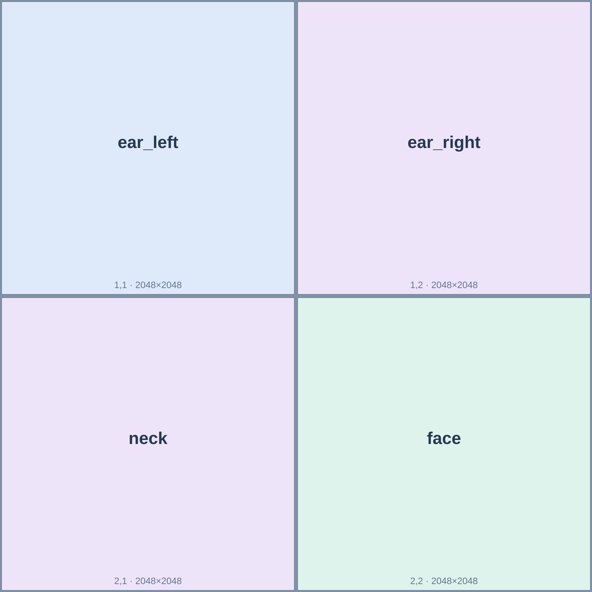
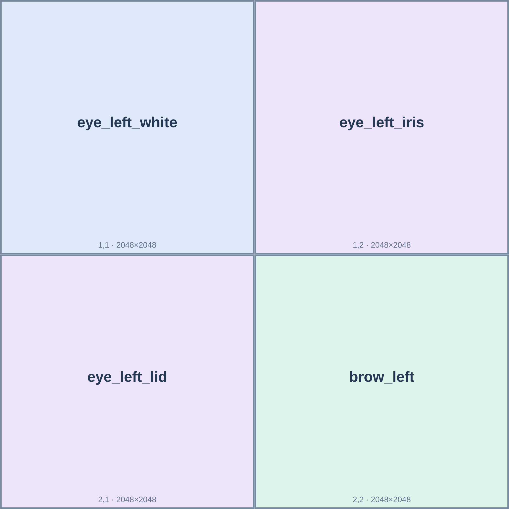
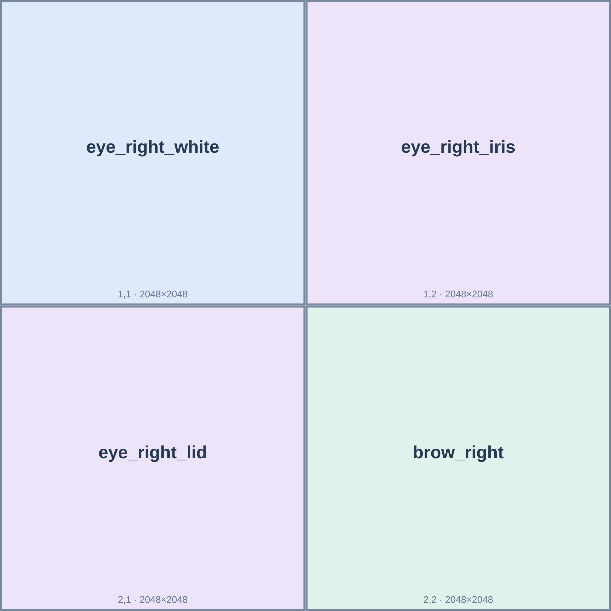
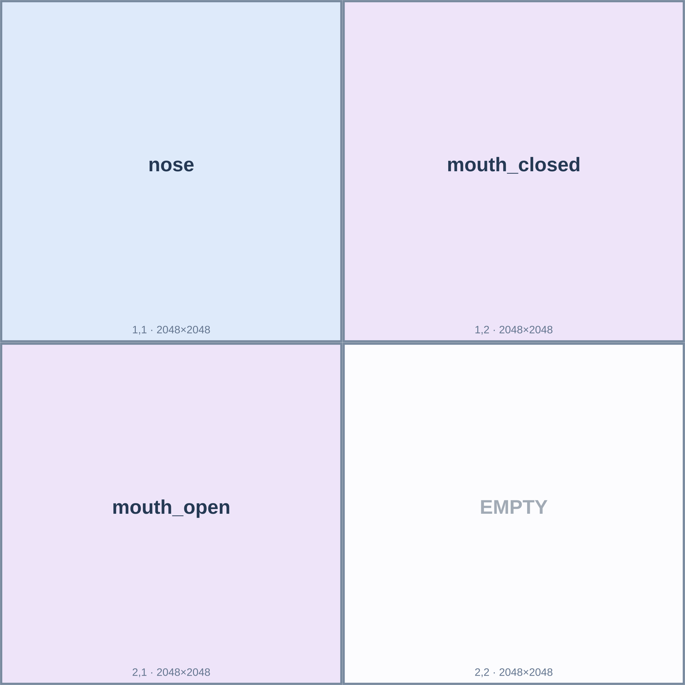
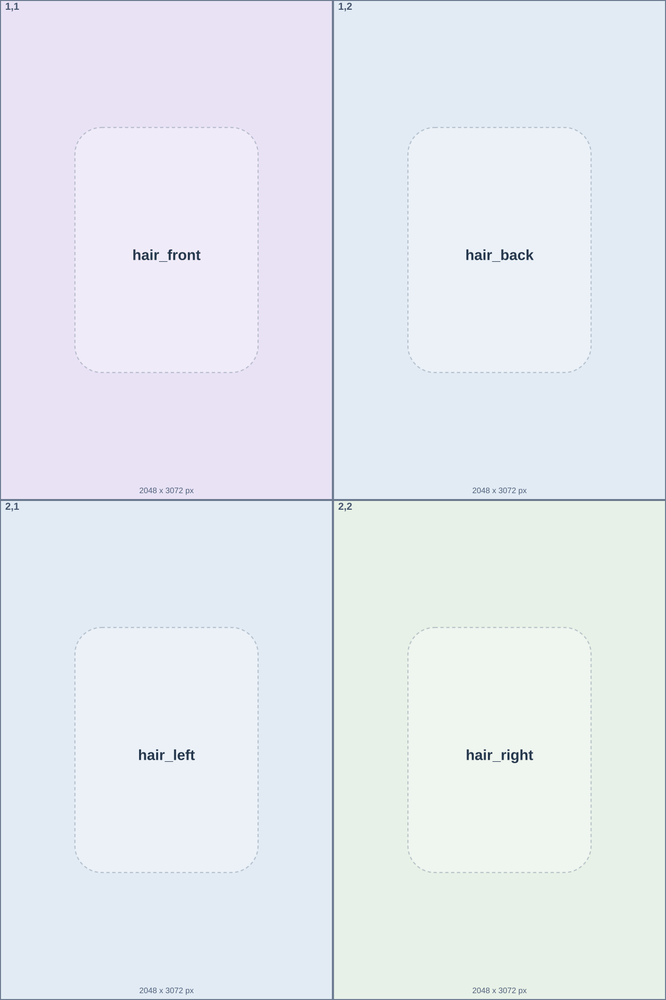
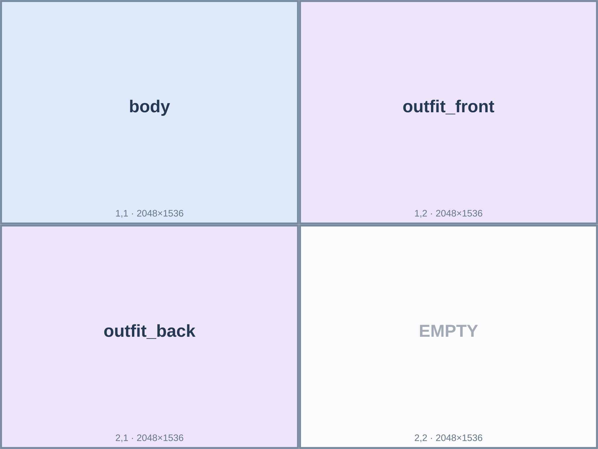
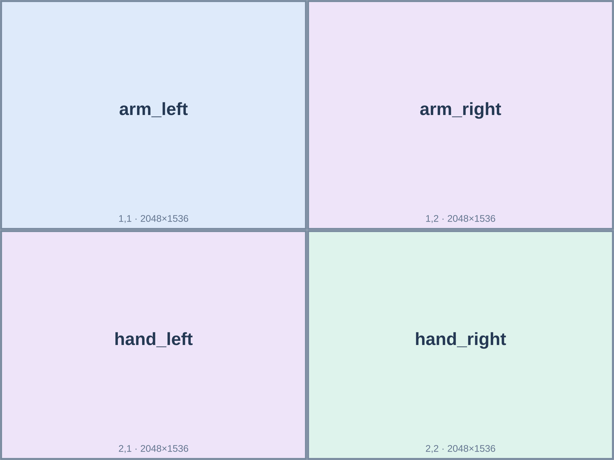
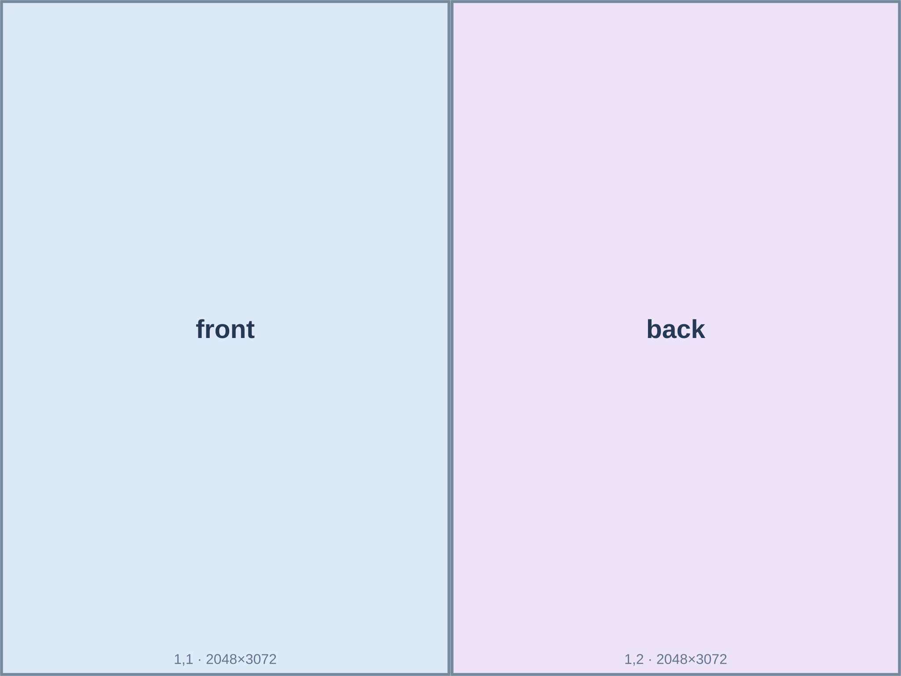
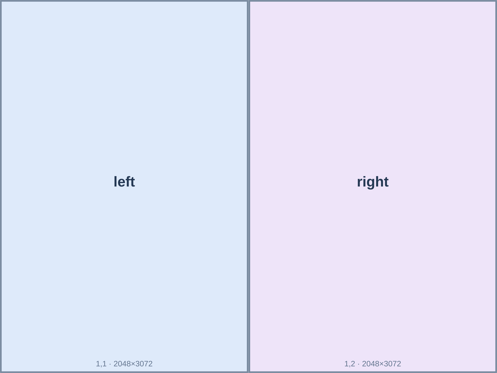

# VTuber Commercial Pipeline

[](https://colab.research.google.com/github/jujumelona/Virtual-pipeline/blob/main/notebooks/VTuber_Commercial_Pipeline_Colab_v8.ipynb)
[](LICENSE)
[](https://www.python.org/)

외부 이미지 생성 AI가 만든 캐릭터 이미지를 입력받아 **Inochi2D**, **Live2D**, **3D VRM** 모델을 제작합니다. 모드별 이미지 생성 사양과 프롬프트는 아래에 정리되어 있습니다.

## 캐릭터 이미지 제작: 비율 고정 · 자동 업스케일 · 분리형 의상

**이미지 생성 AI에는 정확한 픽셀 크기를 강제하지 않습니다.** 아래 프롬프트에서 필요한 것은 **가로:세로 비율**, 시트의 행·열 개수, 각 칸의 파츠 이름, 캐릭터의 일관성입니다. 이미지 AI가 지원하는 실제 기본 해상도로 생성하고, Colab ④ 셀에 올리면 비율을 검사한 뒤 ⑤ 셀에서 **셀 먼저 분할 → 필요할 때 Real-ESRGAN AI 확대 → 리깅 내부 규격으로 정규화**합니다. 비율이 틀어지거나 전체 캐릭터가 파츠 칸을 채우거나 배경이 불투명한 결과는 업스케일만으로 고칠 수 없으므로 다시 생성해야 합니다.

**주의:** 이미지 생성 AI가 격자 순서·알파 투명도·부품 종류까지 자동으로 보장하지는 않습니다. 배치도를 첨부하고 결과를 확인해야 합니다. 배치도에 보이는 글자·색상은 최종 이미지에 포함하지 마세요.

### 2D Live2D / Inochi2D — 기준 이미지 1장 + 파츠 시트 7장

제작 순서는 **기준 정면 1장 → 얼굴 1장 → 양쪽 눈 2장 → 입 1장 → 머리 1장 → 몸/의상 1장 → 팔·손 1장**입니다. 이후 시트마다 완성된 기준 정면과 해당 배치도 2개를 이미지 AI에 첨부합니다.

#### 2D-0. `front_master.png` — 기준 정면

**생성 비율: 세로형 2:3.** 시트가 아닌 캐릭터 기준 이미지 한 장입니다.

**복사할 프롬프트**

```text
CHARACTER IDENTITY (fill in every bracketed field):
Gender / presentation: {gender}
Hair color / HEX: {hair_color}
Hairstyle / bangs / roots / ornaments: {hairstyle}
Eyes / color / pupils / reflections: {eyes}
Face / skin / ears / special markings: {face}
BASE character anatomy / neutral undersuit: {base_body}
DEFAULT removable outfit / fabric / seams: {outfit}
Exact palette / HEX swatches: {palette}
Accessories / locations: {accessories}
Other permanent character details: {other_details}

TASK: Generate and save as front_master.png: one original anime VTuber FRONT reference image.
ASPECT RATIO: portrait WIDTH:HEIGHT = 2:3.
Do not require a specific pixel resolution; render at the model's best
native supported quality. Neutral upright pose, consistent scale,
unoccluded facial landmarks, mouth closed, eyes open, complete hair and
shoulder/arm silhouette, outfit folds and color patches readable.
This front image will be attached to each later sheet as the SAME
character reference. This is a SINGLE character, not a parts worksheet.
No labels, borders, screenshot UI or reference instructions drawn.
```

#### `sheet_face_base.png` — 얼굴 바탕·귀·목

**시트 비율: 1:1, 2열 × 2행.** 각 칸은 동일한 크기입니다. [배치도 원본](docs/sheet_guides/sheet_face_base_layout.svg)



**복사할 프롬프트**

```text
CHARACTER IDENTITY (fill in every bracketed field):
Gender / presentation: {gender}
Hair color / HEX: {hair_color}
Hairstyle / bangs / roots / ornaments: {hairstyle}
Eyes / color / pupils / reflections: {eyes}
Face / skin / ears / special markings: {face}
BASE character anatomy / neutral undersuit: {base_body}
DEFAULT removable outfit / fabric / seams: {outfit}
Exact palette / HEX swatches: {palette}
Accessories / locations: {accessories}
Other permanent character details: {other_details}

IDENTITY LOCK:
ONE identical original VTuber for all images in this mode.
Reference the attached actual front_master.png (not the placement guide)
for character design, neutral pose, perspective, proportions and line art.
The diagram is for sheet CELL ORDER ONLY. Never draw its borders,
text, numbers, colored backgrounds or any watermark.
Character LEFT means its own left (viewer RIGHT in the front view).
Every cell is a separate SEMANTIC layer, not another full character.
True transparent RGBA PNG; invisible content has real alpha=0.
Complete hidden outlines where another part will cover a layer.
Keep relative positions and scale consistent with front_master.png.
Exact pixel-for-pixel registration may require manual correction;
the pipeline can normalize size/aspect but cannot invent missing anatomy.

TASK: Create a single sheet_face_base.png sprite sheet.
OUTPUT CANVAS ASPECT RATIO WIDTH:HEIGHT = 1:1.
LAYOUT = exactly 2 columns and 2 rows, equal-sized rectangular cells.
Render at the highest NATIVE resolution the image AI truly supports.
Do not request a fake large resolution or upscale the sheet yourself.
Row 1, column 1: ear_left
Row 1, column 2: ear_right
Row 2, column 1: neck
Row 2, column 2: face
The face base is skin and jaw only; no baked eyes, hair, brows or mouth.

For each occupied cell, draw ONLY the named part in isolation,
preserving its position and size RELATIVE to the master reference
(front_master.png). Do not draw a complete face or full character in
a component cell. Keep the cell geometry and surrounding area truly
transparent (alpha=0). A reserved EMPTY cell must be fully alpha=0.
Every cell is a part to be independently rigged after extraction.
```

#### `sheet_eye_left.png` — 캐릭터 왼쪽 눈

**시트 비율: 1:1, 2열 × 2행.** 각 칸은 동일한 크기입니다. [배치도 원본](docs/sheet_guides/sheet_eye_left_layout.svg)



**복사할 프롬프트**

```text
CHARACTER IDENTITY (fill in every bracketed field):
Gender / presentation: {gender}
Hair color / HEX: {hair_color}
Hairstyle / bangs / roots / ornaments: {hairstyle}
Eyes / color / pupils / reflections: {eyes}
Face / skin / ears / special markings: {face}
BASE character anatomy / neutral undersuit: {base_body}
DEFAULT removable outfit / fabric / seams: {outfit}
Exact palette / HEX swatches: {palette}
Accessories / locations: {accessories}
Other permanent character details: {other_details}

IDENTITY LOCK:
ONE identical original VTuber for all images in this mode.
Reference the attached actual front_master.png (not the placement guide)
for character design, neutral pose, perspective, proportions and line art.
The diagram is for sheet CELL ORDER ONLY. Never draw its borders,
text, numbers, colored backgrounds or any watermark.
Character LEFT means its own left (viewer RIGHT in the front view).
Every cell is a separate SEMANTIC layer, not another full character.
True transparent RGBA PNG; invisible content has real alpha=0.
Complete hidden outlines where another part will cover a layer.
Keep relative positions and scale consistent with front_master.png.
Exact pixel-for-pixel registration may require manual correction;
the pipeline can normalize size/aspect but cannot invent missing anatomy.

TASK: Create a single sheet_eye_left.png sprite sheet.
OUTPUT CANVAS ASPECT RATIO WIDTH:HEIGHT = 1:1.
LAYOUT = exactly 2 columns and 2 rows, equal-sized rectangular cells.
Render at the highest NATIVE resolution the image AI truly supports.
Do not request a fake large resolution or upscale the sheet yourself.
Row 1, column 1: eye_left_white
Row 1, column 2: eye_left_iris
Row 2, column 1: eye_left_lid
Row 2, column 2: brow_left
Preserve iris/pupil/reflection detail; only the named component in each cell.

For each occupied cell, draw ONLY the named part in isolation,
preserving its position and size RELATIVE to the master reference
(front_master.png). Do not draw a complete face or full character in
a component cell. Keep the cell geometry and surrounding area truly
transparent (alpha=0). A reserved EMPTY cell must be fully alpha=0.
Every cell is a part to be independently rigged after extraction.
```

#### `sheet_eye_right.png` — 캐릭터 오른쪽 눈

**시트 비율: 1:1, 2열 × 2행.** 각 칸은 동일한 크기입니다. [배치도 원본](docs/sheet_guides/sheet_eye_right_layout.svg)



**복사할 프롬프트**

```text
CHARACTER IDENTITY (fill in every bracketed field):
Gender / presentation: {gender}
Hair color / HEX: {hair_color}
Hairstyle / bangs / roots / ornaments: {hairstyle}
Eyes / color / pupils / reflections: {eyes}
Face / skin / ears / special markings: {face}
BASE character anatomy / neutral undersuit: {base_body}
DEFAULT removable outfit / fabric / seams: {outfit}
Exact palette / HEX swatches: {palette}
Accessories / locations: {accessories}
Other permanent character details: {other_details}

IDENTITY LOCK:
ONE identical original VTuber for all images in this mode.
Reference the attached actual front_master.png (not the placement guide)
for character design, neutral pose, perspective, proportions and line art.
The diagram is for sheet CELL ORDER ONLY. Never draw its borders,
text, numbers, colored backgrounds or any watermark.
Character LEFT means its own left (viewer RIGHT in the front view).
Every cell is a separate SEMANTIC layer, not another full character.
True transparent RGBA PNG; invisible content has real alpha=0.
Complete hidden outlines where another part will cover a layer.
Keep relative positions and scale consistent with front_master.png.
Exact pixel-for-pixel registration may require manual correction;
the pipeline can normalize size/aspect but cannot invent missing anatomy.

TASK: Create a single sheet_eye_right.png sprite sheet.
OUTPUT CANVAS ASPECT RATIO WIDTH:HEIGHT = 1:1.
LAYOUT = exactly 2 columns and 2 rows, equal-sized rectangular cells.
Render at the highest NATIVE resolution the image AI truly supports.
Do not request a fake large resolution or upscale the sheet yourself.
Row 1, column 1: eye_right_white
Row 1, column 2: eye_right_iris
Row 2, column 1: eye_right_lid
Row 2, column 2: brow_right
Same iris design and rendering as the left eye, no mirroring the whole face.

For each occupied cell, draw ONLY the named part in isolation,
preserving its position and size RELATIVE to the master reference
(front_master.png). Do not draw a complete face or full character in
a component cell. Keep the cell geometry and surrounding area truly
transparent (alpha=0). A reserved EMPTY cell must be fully alpha=0.
Every cell is a part to be independently rigged after extraction.
```

#### `sheet_mouth.png` — 코·표정용 입

**시트 비율: 1:1, 2열 × 2행.** 각 칸은 동일한 크기입니다. [배치도 원본](docs/sheet_guides/sheet_mouth_layout.svg)



**복사할 프롬프트**

```text
CHARACTER IDENTITY (fill in every bracketed field):
Gender / presentation: {gender}
Hair color / HEX: {hair_color}
Hairstyle / bangs / roots / ornaments: {hairstyle}
Eyes / color / pupils / reflections: {eyes}
Face / skin / ears / special markings: {face}
BASE character anatomy / neutral undersuit: {base_body}
DEFAULT removable outfit / fabric / seams: {outfit}
Exact palette / HEX swatches: {palette}
Accessories / locations: {accessories}
Other permanent character details: {other_details}

IDENTITY LOCK:
ONE identical original VTuber for all images in this mode.
Reference the attached actual front_master.png (not the placement guide)
for character design, neutral pose, perspective, proportions and line art.
The diagram is for sheet CELL ORDER ONLY. Never draw its borders,
text, numbers, colored backgrounds or any watermark.
Character LEFT means its own left (viewer RIGHT in the front view).
Every cell is a separate SEMANTIC layer, not another full character.
True transparent RGBA PNG; invisible content has real alpha=0.
Complete hidden outlines where another part will cover a layer.
Keep relative positions and scale consistent with front_master.png.
Exact pixel-for-pixel registration may require manual correction;
the pipeline can normalize size/aspect but cannot invent missing anatomy.

TASK: Create a single sheet_mouth.png sprite sheet.
OUTPUT CANVAS ASPECT RATIO WIDTH:HEIGHT = 1:1.
LAYOUT = exactly 2 columns and 2 rows, equal-sized rectangular cells.
Render at the highest NATIVE resolution the image AI truly supports.
Do not request a fake large resolution or upscale the sheet yourself.
Row 1, column 1: nose
Row 1, column 2: mouth_closed
Row 2, column 1: mouth_open
Row 2, column 2: EMPTY
Mouth-open is an alternative mouth animation with tongue, teeth, interior; EMPTY is alpha=0.

For each occupied cell, draw ONLY the named part in isolation,
preserving its position and size RELATIVE to the master reference
(front_master.png). Do not draw a complete face or full character in
a component cell. Keep the cell geometry and surrounding area truly
transparent (alpha=0). A reserved EMPTY cell must be fully alpha=0.
Every cell is a part to be independently rigged after extraction.
```

#### `sheet_hair.png` — 앞·뒤·옆머리

**시트 비율: 2:3, 2열 × 2행.** 각 칸은 동일한 크기입니다. [배치도 원본](docs/sheet_guides/sheet_hair_layout.svg)



**복사할 프롬프트**

```text
CHARACTER IDENTITY (fill in every bracketed field):
Gender / presentation: {gender}
Hair color / HEX: {hair_color}
Hairstyle / bangs / roots / ornaments: {hairstyle}
Eyes / color / pupils / reflections: {eyes}
Face / skin / ears / special markings: {face}
BASE character anatomy / neutral undersuit: {base_body}
DEFAULT removable outfit / fabric / seams: {outfit}
Exact palette / HEX swatches: {palette}
Accessories / locations: {accessories}
Other permanent character details: {other_details}

IDENTITY LOCK:
ONE identical original VTuber for all images in this mode.
Reference the attached actual front_master.png (not the placement guide)
for character design, neutral pose, perspective, proportions and line art.
The diagram is for sheet CELL ORDER ONLY. Never draw its borders,
text, numbers, colored backgrounds or any watermark.
Character LEFT means its own left (viewer RIGHT in the front view).
Every cell is a separate SEMANTIC layer, not another full character.
True transparent RGBA PNG; invisible content has real alpha=0.
Complete hidden outlines where another part will cover a layer.
Keep relative positions and scale consistent with front_master.png.
Exact pixel-for-pixel registration may require manual correction;
the pipeline can normalize size/aspect but cannot invent missing anatomy.

TASK: Create a single sheet_hair.png sprite sheet.
OUTPUT CANVAS ASPECT RATIO WIDTH:HEIGHT = 2:3.
LAYOUT = exactly 2 columns and 2 rows, equal-sized rectangular cells.
Render at the highest NATIVE resolution the image AI truly supports.
Do not request a fake large resolution or upscale the sheet yourself.
Row 1, column 1: hair_front
Row 1, column 2: hair_back
Row 2, column 1: hair_left
Row 2, column 2: hair_right
Four isolated hair layers, continuous hidden roots and ends, not four portraits.

For each occupied cell, draw ONLY the named part in isolation,
preserving its position and size RELATIVE to the master reference
(front_master.png). Do not draw a complete face or full character in
a component cell. Keep the cell geometry and surrounding area truly
transparent (alpha=0). A reserved EMPTY cell must be fully alpha=0.
Every cell is a part to be independently rigged after extraction.
```

#### `sheet_body_outfit.png` — 몸과 옷 분리

**시트 비율: 4:3, 2열 × 2행.** 각 칸은 동일한 크기입니다. [배치도 원본](docs/sheet_guides/sheet_body_outfit_layout_v2.svg)



**복사할 프롬프트**

```text
CHARACTER IDENTITY (fill in every bracketed field):
Gender / presentation: {gender}
Hair color / HEX: {hair_color}
Hairstyle / bangs / roots / ornaments: {hairstyle}
Eyes / color / pupils / reflections: {eyes}
Face / skin / ears / special markings: {face}
BASE character anatomy / neutral undersuit: {base_body}
DEFAULT removable outfit / fabric / seams: {outfit}
Exact palette / HEX swatches: {palette}
Accessories / locations: {accessories}
Other permanent character details: {other_details}

IDENTITY LOCK:
ONE identical original VTuber for all images in this mode.
Reference the attached actual front_master.png (not the placement guide)
for character design, neutral pose, perspective, proportions and line art.
The diagram is for sheet CELL ORDER ONLY. Never draw its borders,
text, numbers, colored backgrounds or any watermark.
Character LEFT means its own left (viewer RIGHT in the front view).
Every cell is a separate SEMANTIC layer, not another full character.
True transparent RGBA PNG; invisible content has real alpha=0.
Complete hidden outlines where another part will cover a layer.
Keep relative positions and scale consistent with front_master.png.
Exact pixel-for-pixel registration may require manual correction;
the pipeline can normalize size/aspect but cannot invent missing anatomy.

TASK: Create a single sheet_body_outfit.png sprite sheet.
OUTPUT CANVAS ASPECT RATIO WIDTH:HEIGHT = 4:3.
LAYOUT = exactly 2 columns and 2 rows, equal-sized rectangular cells.
Render at the highest NATIVE resolution the image AI truly supports.
Do not request a fake large resolution or upscale the sheet yourself.
Row 1, column 1: body
Row 1, column 2: outfit_front
Row 2, column 1: outfit_back
Row 2, column 2: EMPTY
WARDROBE / OUTFIT SEPARATION (CRITICAL):
The base body is NOT the selected costume. It is a covered neutral
fitted underlayer/skin base with correct limb and shoulder geometry.
Never bake shirt fabric, coat collars, cuffs or dress details into the
skin/body layer. Hair, head, eyes and body never change with the outfit.
Draw the removable OUTFIT_FRONT and OUTFIT_BACK as two isolated garment
layers. Put all removable collar/fabric/sleeve artwork into clothing
layers, not body or arms. This 26-layer format currently has no separate
sleeve deformation meshes: complex moving sleeves require an editor
adjustment or an extended clothing rig, not a simple layer toggle.

For each occupied cell, draw ONLY the named part in isolation,
preserving its position and size RELATIVE to the master reference
(front_master.png). Do not draw a complete face or full character in
a component cell. Keep the cell geometry and surrounding area truly
transparent (alpha=0). A reserved EMPTY cell must be fully alpha=0.
Every cell is a part to be independently rigged after extraction.
```

#### `sheet_arms_hands.png` — 양쪽 팔·손

**시트 비율: 4:3, 2열 × 2행.** 각 칸은 동일한 크기입니다. [배치도 원본](docs/sheet_guides/sheet_arms_hands_layout.svg)



**복사할 프롬프트**

```text
CHARACTER IDENTITY (fill in every bracketed field):
Gender / presentation: {gender}
Hair color / HEX: {hair_color}
Hairstyle / bangs / roots / ornaments: {hairstyle}
Eyes / color / pupils / reflections: {eyes}
Face / skin / ears / special markings: {face}
BASE character anatomy / neutral undersuit: {base_body}
DEFAULT removable outfit / fabric / seams: {outfit}
Exact palette / HEX swatches: {palette}
Accessories / locations: {accessories}
Other permanent character details: {other_details}

IDENTITY LOCK:
ONE identical original VTuber for all images in this mode.
Reference the attached actual front_master.png (not the placement guide)
for character design, neutral pose, perspective, proportions and line art.
The diagram is for sheet CELL ORDER ONLY. Never draw its borders,
text, numbers, colored backgrounds or any watermark.
Character LEFT means its own left (viewer RIGHT in the front view).
Every cell is a separate SEMANTIC layer, not another full character.
True transparent RGBA PNG; invisible content has real alpha=0.
Complete hidden outlines where another part will cover a layer.
Keep relative positions and scale consistent with front_master.png.
Exact pixel-for-pixel registration may require manual correction;
the pipeline can normalize size/aspect but cannot invent missing anatomy.

TASK: Create a single sheet_arms_hands.png sprite sheet.
OUTPUT CANVAS ASPECT RATIO WIDTH:HEIGHT = 4:3.
LAYOUT = exactly 2 columns and 2 rows, equal-sized rectangular cells.
Render at the highest NATIVE resolution the image AI truly supports.
Do not request a fake large resolution or upscale the sheet yourself.
Row 1, column 1: arm_left
Row 1, column 2: arm_right
Row 2, column 1: hand_left
Row 2, column 2: hand_right
Bare anatomical arms/hands or neutral non-costume undersuit only. No outfit-specific sleeves/cuffs/gloves baked onto base arms or hands.

For each occupied cell, draw ONLY the named part in isolation,
preserving its position and size RELATIVE to the master reference
(front_master.png). Do not draw a complete face or full character in
a component cell. Keep the cell geometry and surrounding area truly
transparent (alpha=0). A reserved EMPTY cell must be fully alpha=0.
Every cell is a part to be independently rigged after extraction.
```

#### 2D 입력 ZIP

```text
character_2d_sheet_pack.zip
└── character_2d_sheet_pack/
    ├── front_master.png
    ├── sheet_face_base.png
    ├── sheet_eye_left.png
    ├── sheet_eye_right.png
    ├── sheet_mouth.png
    ├── sheet_hair.png
    ├── sheet_body_outfit.png
    └── sheet_arms_hands.png
```

### 의상 교체 — 현재 제작 구조의 정확한 범위

**기본 몸 `body`와 팔 `arm_left/right`는 옷을 제외한 중립 베이스**, `outfit_front` 및 `outfit_back`는 기본 옷 전용 레이어입니다. 의상을 교체하려면 **같은 `front_master.png`와 같은 비율·포즈·팔 위치로 새로운 `sheet_body_outfit.png`를 생성하고, 두 `outfit_* ` 레이어만 교체**해야 합니다. 얼굴·머리·피부·팔까지 다시 그리면 캐릭터가 달라집니다.

단, 현재의 두 의상 레이어만으로는 **움직이는 양쪽 소매, 후드, 치마 물리, 옷별 마스크·스킨·메시·키폼이 자동으로 교체되는 기능은 없습니다.** PSD/ORA에서 옷 레이어 교체 후 리깅을 다시 조정해야 합니다. 이 기능을 구현하지 않은 상태에서 방송 중 원클릭 옷 변경이 지원된다고 설명하지 않습니다.

**옷만 다시 생성하는 프롬프트**

```text
CHARACTER IDENTITY (fill in every bracketed field):
Gender / presentation: {gender}
Hair color / HEX: {hair_color}
Hairstyle / bangs / roots / ornaments: {hairstyle}
Eyes / color / pupils / reflections: {eyes}
Face / skin / ears / special markings: {face}
BASE character anatomy / neutral undersuit: {base_body}
DEFAULT removable outfit / fabric / seams: {outfit}
Exact palette / HEX swatches: {palette}
Accessories / locations: {accessories}
Other permanent character details: {other_details}

TASK: Redesign ONLY the detachable costume for the SAME VTuber.
Attach the actual original front_master.png as identity reference.
Aspect ratio WIDTH:HEIGHT = 4:3, 2 columns x 2 rows.
Row1 Col1: unchanged clean BASE BODY, no costume.
Row1 Col2: NEW removable OUTFIT FRONT (fabric, collar, bodice,
sleeves, straps and front garment features only).
Row2 Col1: NEW removable OUTFIT BACK (back panel, rear garment
seams, back accessories).
Row2 Col2: COMPLETELY EMPTY transparent cell.
Keep face, eye, skin tone, anatomy, arms, hair, base pose,
relative size, light, linework and all permanent identity unchanged.
Each cell is its assigned semantic layer only. True alpha transparency.
No grid lines, captions or drawn placement guide.
Render at native supported resolution; no exact pixel requirement.
```

### 3D VRM — 전신 2뷰 시트 2장 + 얼굴 확대 1장

3D도 이미지 생성 단계에서는 픽셀 수 대신 **전신 시트 비율 4:3**과 **얼굴 정사각형 1:1**만 지정합니다. 실제 3D 복원 모델에 전달하기 전 프로그램이 시점을 개별 분할하고 내부 크기로 정규화합니다.

#### `sheet_front_back.png` — 정면·후면

**시트 비율: 4:3, 2열 × 1행.** [배치도 원본](docs/sheet_guides/sheet_front_back_layout.svg)



**복사할 프롬프트**

```text
CHARACTER IDENTITY (fill in every bracketed field):
Gender / presentation: {gender}
Hair color / HEX: {hair_color}
Hairstyle / bangs / roots / ornaments: {hairstyle}
Eyes / color / pupils / reflections: {eyes}
Face / skin / ears / special markings: {face}
BASE character anatomy / neutral undersuit: {base_body}
DEFAULT removable outfit / fabric / seams: {outfit}
Exact palette / HEX swatches: {palette}
Accessories / locations: {accessories}
Other permanent character details: {other_details}

TASK: Generate the SAME original VTuber as TWO separate full-body
ORTHOGRAPHIC reference views in one sheet_front_back.png image.
CANVAS ASPECT RATIO WIDTH:HEIGHT = 4:3.
LAYOUT exactly 2 equal-width columns in one row.
Column 1: FRONT full body
Column 2: BACK full body
Each individual view cell is portrait WIDTH:HEIGHT=2:3.
Match crown, shoulders, waist, feet and body centerline between views,
with the same visual scale, neutral A-pose and head-to-foot framing.
Rotate the character naturally, never mirror the front image.
This is the first 3D multiview image; preserve this reference identity for the other views.
Render in the best NATIVE resolution supported by your image model;
do not specify an absolute pixel width or height.
The attached diagram is only a layout reference, not image content.
No drawn dividers, labels, colored boxes, text or watermark.
```

#### `sheet_side_views.png` — 좌·우 측면

**시트 비율: 4:3, 2열 × 1행.** [배치도 원본](docs/sheet_guides/sheet_side_views_layout.svg)



**복사할 프롬프트**

```text
CHARACTER IDENTITY (fill in every bracketed field):
Gender / presentation: {gender}
Hair color / HEX: {hair_color}
Hairstyle / bangs / roots / ornaments: {hairstyle}
Eyes / color / pupils / reflections: {eyes}
Face / skin / ears / special markings: {face}
BASE character anatomy / neutral undersuit: {base_body}
DEFAULT removable outfit / fabric / seams: {outfit}
Exact palette / HEX swatches: {palette}
Accessories / locations: {accessories}
Other permanent character details: {other_details}

TASK: Generate the SAME original VTuber as TWO separate full-body
ORTHOGRAPHIC reference views in one sheet_side_views.png image.
CANVAS ASPECT RATIO WIDTH:HEIGHT = 4:3.
LAYOUT exactly 2 equal-width columns in one row.
Column 1: CHARACTER LEFT full body
Column 2: CHARACTER RIGHT full body
Each individual view cell is portrait WIDTH:HEIGHT=2:3.
Match crown, shoulders, waist, feet and body centerline between views,
with the same visual scale, neutral A-pose and head-to-foot framing.
Rotate the character naturally, never mirror the front image.
Attach the already-generated FRONT/BACK image as identity reference.
Render in the best NATIVE resolution supported by your image model;
do not specify an absolute pixel width or height.
The attached diagram is only a layout reference, not image content.
No drawn dividers, labels, colored boxes, text or watermark.
```

#### `face.png` — 3D 정면 얼굴 확대

**이미지 비율: 1:1.** 전신 시트 정면을 실제 참조 이미지로 첨부합니다.

**복사할 프롬프트**

```text
CHARACTER IDENTITY (fill in every bracketed field):
Gender / presentation: {gender}
Hair color / HEX: {hair_color}
Hairstyle / bangs / roots / ornaments: {hairstyle}
Eyes / color / pupils / reflections: {eyes}
Face / skin / ears / special markings: {face}
BASE character anatomy / neutral undersuit: {base_body}
DEFAULT removable outfit / fabric / seams: {outfit}
Exact palette / HEX swatches: {palette}
Accessories / locations: {accessories}
Other permanent character details: {other_details}

TASK: One frontal orthographic close-up of the exact SAME character
from column 1 of sheet_front_back.png.
ASPECT RATIO WIDTH:HEIGHT=1:1 (square).
High-detail eyes, eyelids, iris, nose, mouth, hairline and ears.
Face centered naturally, no cropping or perspective distortion.
Match original hair, face shape, gender presentation, makeup,
earrings, skin tone and linework exactly.
Use your AI image model's native available resolution, not a fixed
pixel count. No grid lines, labels, text, collage or watermark.
```

#### 3D 입력 ZIP

```text
character_3d_sheet_pack.zip
└── character_3d_sheet_pack/
    ├── sheet_front_back.png
    ├── sheet_side_views.png
    └── face.png
```

**3D 의상 변경:** 현재 3D 경로는 완성된 VRM의 임의 옷을 자동 탈착·교환하는 전용 의상 리깅 기능이 아닙니다. 새 의상의 정면·후면·측면 이미지로 모델을 다시 생성하거나, 별도 의상 메시와 스킨을 제작해 Blender 등에서 VRM에 연결해야 합니다. 액세서리 모드를 옷 교체 기능으로 간주하지 않습니다.

### 액세서리 이미지

```text
Accessory type: {accessory_type}
Materials: {material}
Colors: {color}
Decorations: {decoration}
Attachment location: {anchor}
Output a single isolated original VTuber accessory, transparent PNG.
Use any reasonable native resolution. No other character or text.
```

**입력 진단:** 프로그램은 ZIP 파일 수·PNG·비율·RGBA/빈칸을 우선 검사합니다. 합격해도 외형 일치나 가려진 파츠를 보증하지 않습니다. 비율·실제 투명도·파트 내용이 틀린 이미지를 단순 AI 업스케일로 정상 파츠로 위장하지 않습니다.

## 작업 모드

| UI 모드 | 오픈소스 기반 준비 도구 | 현재 실제 출력 | 완성 방송 모델의 포맷 | 구현 상태 |
|---|---|---|---|---|
| **Inochi2D** | Florence-2 / SAM2 / FLUX + Inochi2D SDK | 실제 레이어 PSD/ORA, 메시·키폼·물리 JSON | `.inp` | **네이티브 구현 및 SDK E2E PASS**: 공식 0.8.7 SDK로 변형·물리 `.inp`를 실제 생성/재로딩. 입력 모델별 SDK 검증 성공 시에만 `complete`, 실패 시 `prepared` |
| **Live2D** | 동일 2D 레이어·리깅 중간 표현 + 정식 Cubism Editor | `avatar.psd`, `cubism_handoff.zip` | `.moc3` + `.model3.json` + 텍스처/물리 | **needs_editor_export**: 공식 Editor에서 출력한 폴더만 검증·수집. 자동 MOC3 인코더 없음 |
| **3D VRM** | TripoSR, Depth Anything V2 Small, MakeHuman, Blender VRM Add-on | 피팅/텍스처/리깅 자료 및 검증 시 `avatar.vrm` + `avatar_rigged.blend` | `.vrm` | **상업용 모델 교체 반영**: InstantMesh 제외, MIT TripoSR 정면·후면·좌우 독립 복원으로 대체. 실제 Colab T4 E2E 검증은 별도 |

**2D 중간 준비 ZIP은 최종 모델이 아닙니다.** Inochi2D는 SDK가 검증한 `.inp`만 방송 모델로 인정하며, Live2D는 정식 Cubism Editor에서 내보낸 `.moc3`만 최종 모델로 인정합니다. 준비된 PSD/ORA는 보완·후속 수정을 위한 편집 자료입니다.

### Inochi2D

- 기본 시트 입력: `character_2d_sheet_pack.zip` (기준 이미지 1장 + 고해상도 시트 7장). 각 시트의 배치 그림과 복사용 프롬프트는 위 제작 가이드 참조.
- 현재 출력: `avatar.psd`, `avatar.ora`, `meshes2d.json`, `keyforms.json`, `physics2d.json`, `puppet_spec.json`. SDK 네이티브 출력에 성공한 경우에만 `avatar.inp`를 `complete`로 보고합니다.
- 네이티브 자동화: 공식 BSD-2 **Inochi2D SDK 0.8.7**의 실제 `MeshData`·`Part`·`DeformationParameterBinding`·`SimplePhysics`를 구성하고 SDK의 `inWriteINPPuppet`로 **실제 INP1**을 출력합니다. SDK로 다시 읽어 애니메이션·물리 바인딩을 검사합니다. 0.9 개발판은 현재 변형 바인딩이 비활성화되어 본선에 사용하지 않습니다.
- 실제 컴파일+SDK 네이티브 INP 재임포트 검증: [GitHub Actions PASS](https://github.com/jujumelona/Virtual-pipeline/actions/runs/37878238975). 이 검증은 SDK 프로그램의 정상 작동을 증명하며 **사용자별 AI 파츠 품질을 보증하지는 않습니다.**
- Colab Inochi2D 선택 시 DUB/LDC·SDL2/Xvfb 런타임을 준비합니다. CLI는 필요할 때 자동 SDK 빌드를 시도합니다. 유효한 실행 파일 또는 메시·키폼·물리 바인딩이 없으면 중간 PSD/ORA를 `prepared`로 반환하고, 네이티브 `.inp` 완성을 가장하지 않습니다. [공식 Inochi2D 문서](https://docs.inochi2d.com/en/latest/) 참조.

### Live2D

- 입력: 기준 이미지 + 고해상도 파츠 시트 7장이 들어 있는 ZIP 1개
- 현재 출력: `avatar.psd`, `avatar.ora`, `cubism_handoff.zip`, `cubism_spec.json`. 공식 Editor 내보내기 결과의 MOC3·텍스처·physics·model3 참조는 별도 `live2d-import-export`에서 확인합니다.
- 목표: **Live2D Cubism Editor에서 리깅 후 `.moc3`, `.model3.json`, 텍스처/물리 출력**, VTube Studio에서 로드.
- **Live2D Cubism Editor는 비오픈소스**입니다. 공식 모델 바이너리 생성은 [Cubism 내보내기 문서](https://docs.live2d.com/en/cubism-editor-manual/export-moc3-motion3-files/)에 기술돼 있습니다. 검증된 상업용 오픈소스 MOC3 인코더가 없어 이 프로젝트는 완성된 Live2D 모델을 자동 생성한다고 주장하지 않습니다.
- Inochi2D의 `.inp`는 Live2D의 `.moc3`로 자동 호환되지 않습니다.

### 2D CLI

```bash
vtuber-pipeline inochi2d --image character.png --layers-zip layers.zip --output output/inochi2d
vtuber-pipeline live2d --image character.png --output output/live2d
vtuber-pipeline live2d-import-export --official-export-dir ./cubism-output --output output/live2d
```

사용자 원본 이미지 자체의 상업적 사용 권한은 별도로 확보해야 합니다. 앱·프레임워크의 소스 라이선스와 모델 가중치·데이터 라이선스도 개별 확인해야 합니다.

3D VRM 및 액세서리의 기존 실행·검증 기능은 아래와 같습니다.

## Mainline

### Avatar Mode

```text
front full-body image + independent face reference
+ optional real back / left / right reference images
→ reference quality and 28-point facial landmark validation
→ ISNet foreground segmentation + Depth Anything V2 relative depth
→ pinned MIT TripoSR reconstruction for front and each observed extra view
→ fixed camera-role yaw registration + rejection of inconsistent views
→ evidence-aware multiview alignment (front-only remains inferred geometry)
→ pinned MakeHuman CC0 canonical topology fitting and limited surface refinement
→ 2048-texel multiview atlas (front/face/back/left/right)
→ explicitly identified inferred appearance only for unobserved UV polygons
→ humanoid skin + eye bones + skinned independent hair geometry
→ blink / visemes / emotions / eye-bone gaze / VRMC_springBone
→ initial VRM 1.0 → native Blender VRM Add-on round-trip and .blend project
→ strict VRM product validator
→ avatar.vrm + avatar_rigged.blend
```

필수 stage가 실패하거나 필수 artifact가 없으면 최종 상태는 `failed`입니다. canonical template이나 placeholder 결과로 조용히 대체하지 않습니다.

### Accessory Mode

```text
completed avatar.vrm
+ accessory images
→ pinned TripoSR reconstruction per item
→ GLB normalization
→ real VRM bone anchor extraction
→ scale / transform fitting
→ penetration check + push-out
→ static GLB merge with index/buffer remapping
→ bone parenting
→ combined.vrm
```

Accessory Mode는 검증된 **static bone-parented bake** 경로만 제공합니다.

## 3D 상업용 경로: 사용권이 제한된 모델의 실제 교체 (2026-10-09)

이 저장소의 **활성 3D 본선에는 이제 InstantMesh와 Zero123++가 포함되지 않습니다.** 사용자에게 없는 상업용 사용권을 요구하지 않도록, 이미 상업적 이용이 가능한 소스/가중치가 확인된 **TripoSR(MIT)** 로 각 실제 입력 시점을 따로 재구성한 뒤, Depth Anything V2 Small 및 canonical MakeHuman 피팅에 연결했습니다.

- 필수: 정면 전신 이미지와 얼굴 확대 이미지. 정면만 있어도 배경 제거·정면 메시·상대 깊이·표면 정합을 실행합니다.
- 품질 향상: 실제 후면·좌/우 측면 사진을 올리면 각 입력으로 **독립 TripoSR 메시**를 만들고, 고정 카메라 방향과 오차 임계값으로 등록 가능한 메시만 결합합니다. 세 측면 전부가 필수는 아닙니다.
- 색상: 정면·얼굴·후면·측면 참조로 각 UV 텍셀을 투영합니다. 입력에서 보이지 않는 표면은 투명하게 방치하지 않고 **추정 색상**으로 보완하며, 관측/추정 픽셀 통계를 별도로 보관합니다.
- 본: MakeHuman topology, 얼굴 Shape Keys, 시선 및 SpringBone, 별도 스킨 적용 머리카락 메시, Blender 네이티브 검증을 유지합니다.
- **정확도 한계:** 서로 다른 그림의 카메라는 실제로 보정되지 않았습니다. 추가 참조가 있어도 3D 형태 및 의상 뒤쪽이 측정되었다고 주장하지 않습니다. 이미지 일관성이 나쁘면 보조 메시를 거절합니다.
- **실행 검증:** CPU 계약 CI와 별개로 Colab T4에서 전체 모델·Blender 실행을 최종 통과해야 방송 품질을 확정할 수 있습니다.

기존 `tools/model_workers/instantmesh_worker.py` 및 연구용 원본 어댑터는 상업용 본선에서 제외하고 사용권 감사 목적으로만 유지합니다. Zero123++ 공개 가중치는 [CC BY-NC 4.0](https://github.com/SUDO-AI-3D/zero123plus#license)이며 Nvidia 코드의 별도 사용 제한도 [nvdiffrast 라이선스](https://github.com/NVlabs/nvdiffrast/blob/main/LICENSE.txt)에 명시되어 있습니다. 우회 추정 뷰를 넣는 것만으로 Nvidia 코드 사용권이 해결되는 것은 아니므로 해당 접근은 본선에 채택하지 않았습니다.

### 선택형 SkinTokens 스키닝 개선과 라이선스 경계

`rigging.provider=skintokens`는 기본 휴머노이드 결과를 먼저 만든 후 **선택한 경우에만** 별도 프로세스에서 SkinTokens를 실행합니다. 동일한 메시·UV·관절 이름과 머리카락 본 바인딩이 유지되는 경우에만 스킨 가중치를 교체하며, 실행 환경이나 체크포인트가 없으면 실패를 보고합니다. 기본 `canonical` 경로는 해당 모델에 의존하지 않습니다.

SkinTokens의 주 저장소와 배포 가중치는 MIT로 안내되지만, [업스트림 상업 배포 문의 #9](https://github.com/VAST-AI-Research/SkinTokens/issues/9)에서 관리자는 **Michelangelo 하위 폴더에는 GPL 표시가 적용된다**고 밝혔습니다. GPL은 상업적 이용 자체를 금지하지 않지만 배포 방식에 따라 소스 제공 의무가 발생할 수 있습니다. 본 저장소는 SkinTokens 코드·가중치를 기본 패키지에 동봉하거나 상업용 기본 모델로 자동 선택하지 않습니다. 해당 개선 옵션의 별도 배포·상업 이용 시 실제 사용 파일의 라이선스 및 GPL 준수 여부를 확인해야 합니다. SkinTokens가 전신 캐릭터의 스키닝 정확도를 반드시 향상시킨다는 보장은 없으며, 실제 추론 및 애니메이션 품질 검증 전에는 완성 판정을 대체하지 않습니다.

## Commercial source policy

| Component | Pin | License |
|---|---|---|
| TripoSR source | `107cefdc244c39106fa830359024f6a2f1c78871` | MIT |
| Marching Cubes mesh extraction | `scikit-image==0.26.0` (prebuilt wheel) | BSD-3-Clause |
| TripoSR model snapshot | `c1cf7716aed5aa6c1c5e174657791ef0e1327bde` + verified `model.ckpt` SHA256 | model license in upstream repository |
| TripoSR nested DINO config | `facebook/dino-vitb16@f205d5d8e640a89a2b8ef0369670dfc37cc07fc2` | Apache-2.0 |
| rembg runtime | `2.0.85` | MIT |
| rembg background model | forced `u2net`, MD5 `60024c5c889badc19c04ad937298a77b` | Apache-2.0 |
| anime-face-detector package | `0.1.0` | MIT |
| anime face YOLOv3 weight | `afdd4226a79ae8bb81f334dbcffd34f8cc000c38` + SHA256 `23bbc708…b2c4` | MIT |
| anime face HRNetV2 weight | `9b3435248b26aeb82e2a8578fe9d86d5d57158af` + SHA256 `e7127137…7a4a` | MIT |
| MakeHuman base mesh | `a8bc2d54ff0ac92e78ff71431b1023eda42bf482` | CC0 |
| VRM writer | local `pygltflib` path | project dependency |

Commercial/production avatar reconstruction verifies the TripoSR git revision before running. The local deterministic TripoSR wrapper also pins the nested DINO config revision and overrides rembg's no-argument default so background removal always uses the Apache-2.0 `u2net` model rather than a changing rembg default. Cached/downloaded `u2net.onnx` bytes are checksum-verified before inference. The anime face path likewise resolves the exact YOLOv3 and HRNetV2 Hugging Face revisions and verifies both safetensors SHA256 values before constructing the detector.

`third_party.lock.json` separates source revisions from binary integrity hashes. `artifact_sha256` is never filled with a git SHA or package version. It is reserved for a real SHA256 of downloaded artifact bytes.

## Optional Blender bone-heat body skinning (Colab T4 compatible)

The avatar builder now supports a second experimental open-source weight
provider. It reuses the **already-installed Blender** native
`bpy.ops.object.parent_set(type="ARMATURE_AUTO")` bone-heat solver on the
actual canonical rig/mesh. Blender returns named per-vertex top-four weight
groups; our adapter maps them back to the unchanged VRM joint palette.

Only **body vertices below the neck** can be modified. Head, eyes, facial
shapes and independent spring-driven hair ribbons stay on their canonical
weights and hierarchy. The original mesh topology, original texture and
UV coordinates are preserved and verified after saving the new GLB.
Unweighted or foreign-joint body vertices, a solver failure or a changed
vertex count produces an explicit failed stage; no silent downgrade is
reported as a finished model. The user can choose canonical when the
optional heat solver is not suitable for an individual character.

Colab native notebook: ③ 생성 셀에서 `generate(..., rigging_provider="blender_heat")`를 선택합니다. 기본값은 검증 경로 `canonical`입니다.
CLI:

```bash
vtuber-pipeline avatar --image character.png --output output/avatar \
  --face-image face.png --full-body --rigging-provider blender_heat
```

Unlike SkinTokens, this alternative does not require Ampere or
FlashAttention-2 and can run on the standard Colab T4 configuration.
The CPU integration test verifies geometry/UV/hair preservation and
rejected invalid weights. Actual native Blender bone-heat deformation
quality on complex meshes and full Colab T4 broadcast playback are
still unverified; this option is **not the default**.

## Optional SkinTokens / TokenRig auto-skinning

**Implemented, experimental; not part of the default T4 workflow.**
The [SkinTokens upstream](https://github.com/VAST-AI-Research/SkinTokens) is MIT licensed
and the published model is MIT tagged. Its source is pinned to
`273b691d35989d71cd17ff2895fdc735097b92d1`.

On a compatible GPU the optional stage invokes the upstream `demo.py` with
`--use_skeleton --use_transfer` in an isolated Python environment. It validates
source/candidate vertex positions, UV order, skeleton names, normalized
weights and preserved head/hair binding; **only JOINTS_0 and WEIGHTS_0**
are transplanted into the canonical rigged GLB. The original mesh, texture,
VRM bone hierarchy, face morphs, hair chains and look-at remain authoritative.
Any mismatch is a build failure, never a fabricated or silently degraded rig.

**Colab T4 warning:** upstream SkinTokens hardcodes BF16 and FlashAttention-2;
the official kernels require Ampere+ (SM >= 8.0). NVIDIA T4 (SM 7.5) is
therefore not compatible, notwithstanding 16 GB VRAM. Preflight blocks
unsupported GPUs before checkpoint download or expensive TripoSR stages.
Use **canonical** 3D rigging on T4. On a supported GPU, SkinTokens
requires >=14 GiB of *free* VRAM. Real GPU end-to-end quality is not yet verified.

SkinTokens 별도 설치·검증은 고급 CLI의 명시적 작업으로만 수행하고, 기본 Colab 노트북은 자동 설치하지 않습니다
and select **SkinTokens 실험적 스키닝**. The explicit installer never runs
during generation. Equivalent CLI setup on an Ampere+ GPU:

```bash
python -m pip install uv
python tools/setup_skintokens_runtime.py --directory /content/third_party/SkinTokens
export VTUBER_SKINTOKENS_DIR=/content/third_party/SkinTokens
export VTUBER_SKINTOKENS_PYTHON=/content/third_party/SkinTokens/.venv/bin/python
vtuber-pipeline avatar --image character.png --output output/avatar \
  --face-image face.png --full-body --rigging-provider skintokens
```

The installer checks out pinned source, creates a Python 3.11 virtual
environment, installs upstream dependencies, fetches the official two
checkpoints and verifies actual artifact hashes in the runtime identity.
TripoSR, FLUX and Colab base PyTorch packages are not replaced.

**Licensing caution:** the model card describes training on ArticulationXL,
VRoid Hub and ModelsResource. The MIT license declaration on the model
does not independently audit rights in every source training asset.
Check applicable dataset and model terms before commercial deployment.

## Installation

로컬에서 설치할 경우 TripoSR의 오래된 `requirements.txt`를 그대로 설치하지 마세요. Colab launcher와 동일한 호환성 세트를 사용하는 것이 기준입니다.

```bash
git clone https://github.com/jujumelona/Virtual-pipeline.git
cd Virtual-pipeline

git clone https://github.com/VAST-AI-Research/TripoSR.git
git -C TripoSR checkout 107cefdc244c39106fa830359024f6a2f1c78871

python -m pip install -e . --no-deps
export TRIPOSR_DIR="$PWD/TripoSR"
```

지원 Python은 **3.12 또는 3.13**입니다.

## Google Colab

상단 **Open In Colab** 버튼에서 v8 노트북을 엽니다. 2D와 전신 3D 고화질 입력은 각각 이 README의 ZIP 파일 구조와 정확한 파일명을 따릅니다. ③ 셀에서 얼굴 검출 및 Real-ESRGAN 초해상도 모델을 준비하고, ④ 셀에서는 선택 모드의 시트 ZIP 하나를 받습니다. ⑤ 셀은 시트를 검증된 격자로 분할한 뒤 필요한 파츠에 GPU 초해상도를 적용하고 해당 GPU 작업자를 종료하여 다음 모델로 넘어갑니다. **① 저장소 준비 → ② 모드 선택 → ③ 필수 프로그램·Python 의존성·AI 모델 병렬 다운로드 및 검증 → ④ 사진·VRM·액세서리 업로드 → ⑤ 제작 → ⑥ 제작 결과 파일 다운로드 → ⑦ 상태·로그 진단 → ⑧ 마지막 셀** 순서입니다. **모든 단계가 서로 다른 Colab 셀**입니다. ③ 셀은 **선택한 모드의** 독립적인 프로그램 설치·모델 다운로드를 최대 3개 병렬로 실행하고, 작업 검증이 끝난 다음에만 완료됩니다. 동일한 Python 환경을 공유하는 pip 변경은 충돌 방지를 위해 직렬화합니다. ④ 업로드가 완료되면 ⑤ 제작은 업로드 창을 다시 열지 않으며, **제작 셀에서 프로그램·모델을 자동 설치하지 않습니다.** ⑥ 결과 파일 다운로드는 `DOWNLOAD_NOW=True`를 선택한 경우에만 실행됩니다. 작업 실패 시 ⑤ 셀은 오류를 표시하고 완성 파일로 취급하지 않습니다. ⑧은 별도의 마지막 셀입니다. Gradio나 별도 웹 서버는 실행하지 않습니다. **⑤ 제작 셀을 중지하면 AI 작업자와 하위 GPU 작업에 종료를 요청합니다.** 전체 로그는 `/content/vtuber_builder/jobs/`에 보존됩니다(런타임이 삭제되면 `/content`의 임시 파일은 유지되지 않을 수 있음). **Colab이 GPU 할당량이나 메모리 문제로 런타임 자체를 끊는 상황은 마지막 셀 추가로 방지할 수 없습니다.**

### ① 캐릭터 / 얼굴 만들기

- 기본 다중 시점 모드: `character_3d_sheet_pack.zip` 1개 업로드 (정면·후면 2뷰 시트 1장 + 좌·우 측면 2뷰 시트 1장 + 얼굴 확대 1장)
- 2D 모드: `character_2d_sheet_pack.zip` 1개 업로드 (정면 기준 1장 + 얼굴·양쪽 눈·입·머리·의상·팔/손 총 7개 고해상도 시트)
- 출력 사용 범위 선택
- 얼굴/머리/상체 fitting
- blink / viseme / emotion morph
- eye-bone look-at
- hair SpringBone
- **캐릭터 VRM 생성**
- 검증된 `avatar.vrm`은 `/content/vtuber_builder/avatar.vrm`에도 복사합니다. Colab **왼쪽 파일 탐색기**에서 다운로드하거나, 생성 종료 후 **⑥ 결과 다운로드 전용 셀**에서 `DOWNLOAD_NOW=True`를 선택하여 내려받을 수 있습니다. 브라우저 다운로드 요청을 생성 셀 내부에서 강제로 시작하지 않습니다.

### ② 악세사리 만들기

Colab의 `TASK`를 **액세서리 제작**으로 선택할 때만 실행합니다. 일반 캐릭터 생성은 `TASK=캐릭터 생성`이 기본이고, `MODE`에서 3D VRM/Inochi2D/Live2D를 선택합니다. 액세서리 `ACCESSORY_ANCHOR=AUTO`는 파일명에 포함된 hat/glasses/shoes 등의 키워드에 따라 개별 부착 위치를 지정하며, 판별할 수 없는 파일명은 적용 전에 오류로 알려줍니다. `ALL`은 업로드한 각 액세서리를 **모든 지원 부착 위치에 각각 적용**합니다. 이는 업로드 이미지 전체를 한 번에 받는 기능과 별개이며, 총 적용 횟수가 커질 수 있습니다. 원본 이미지 3D 복원 결과는 중복 계산하지 않고 재사용합니다.

- 방금 만든 캐릭터 VRM 재사용 또는 기존 VRM 업로드
- 악세사리 슬롯 최대 8개
- 슬롯마다 이미지와 부착 위치를 **독립적으로 선택**
- 각 악세사리 3D 재구성 / fitting / collision / bone parenting
- **악세사리 적용**
- 결과 VRM 다운로드

## CLI

### Avatar

```bash
vtuber-pipeline avatar \
  --image my_character.png \
  --output output/avatar \
  --profile commercial \
  --commercial-usage corporation
```

### Accessory

```bash
vtuber-pipeline accessory \
  --base-vrm output/avatar/avatar.vrm \
  --images crown.png \
  --images ribbon.png \
  --anchor HEAD_TOP \
  --anchor LEFT_EAR \
  --output output/accessories
```

## Python API

```python
from vtuber_pipeline.avatar import build_avatar
from vtuber_pipeline.accessory import reconstruct_accessories, AccessoryPipeline

avatar = build_avatar(
    image_path="character.png",
    output_dir="output/avatar",
    config={
        "profile": "commercial",
        "commercial_usage": "corporation",
    },
)
if avatar["status"] != "complete":
    raise RuntimeError(avatar)

reconstructed = reconstruct_accessories(
    ["crown.png"],
    "output/accessory_reconstruction",
)
mesh = reconstructed[0]["mesh"]

variant = AccessoryPipeline("output/crown").build(
    base_vrm=avatar["vrm_path"],
    accessory_glb=mesh,
    config={
        "anchor_name": "HEAD_TOP",
    },
)
```

## Canonical template

Production does not use the old sphere/cylinder/box template. `get_template_path()` resolves an explicit `VTUBER_TEMPLATE_PATH`, an existing repository template, or creates a cached template from the pinned MakeHuman CC0 `base.obj`.

Facial expression vertex groups are derived from the active fitted/rigged mesh topology by default. Historical fixed vertex-index maps are not used in production.

## Validation contract

A completed avatar requires all of the following:

- VRMC_vrm 1.0 extension
- required humanoid bone bindings
- skin + `JOINTS_0` + `WEIGHTS_0`
- embedded material / texture / image
- blink, blinkLeft, blinkRight
- aa, ih, ou, ee, oh
- happy, angry, sad, relaxed, surprised
- morph-target binds that point to real targets
- valid look-at configuration
- at least one valid SpringBone chain

## Repository layout

```text
notebooks/
  VTuber_Commercial_Pipeline_Colab.ipynb
tools/
  audit_third_party.py
  fetch_cc0_assets.py
vtuber_pipeline/
  avatar/
    build.py
    input_gate.py
    face_detector.py
    reconstruction.py
    template_mesh.py
    template_fitting.py
    texture_transfer.py
    rigging.py
    expressions.py
    gaze.py
    springbone.py
    vrm_builder.py
    vrm_export.py
    validator.py
  accessory/
    reconstruction.py
    normalize.py
    anchors.py
    fitting.py
    collision.py
    bake.py
    build.py
tests/
third_party.lock.json
```

## Integrity audit

```bash
python tools/audit_third_party.py
```

감사 도구는 실제 다운로드된 파일이 있을 때만 SHA256을 계산합니다. 외부 artifact가 로컬에 없으면 hash를 만들어내지 않습니다.

## License

프로젝트 코드는 MIT입니다. 외부 구성요소의 라이선스와 고정 revision은 `third_party.lock.json` 및 canonical asset provenance 문서에서 별도로 관리합니다.
