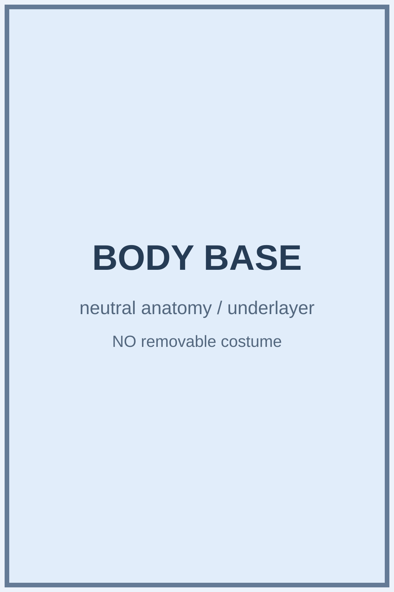
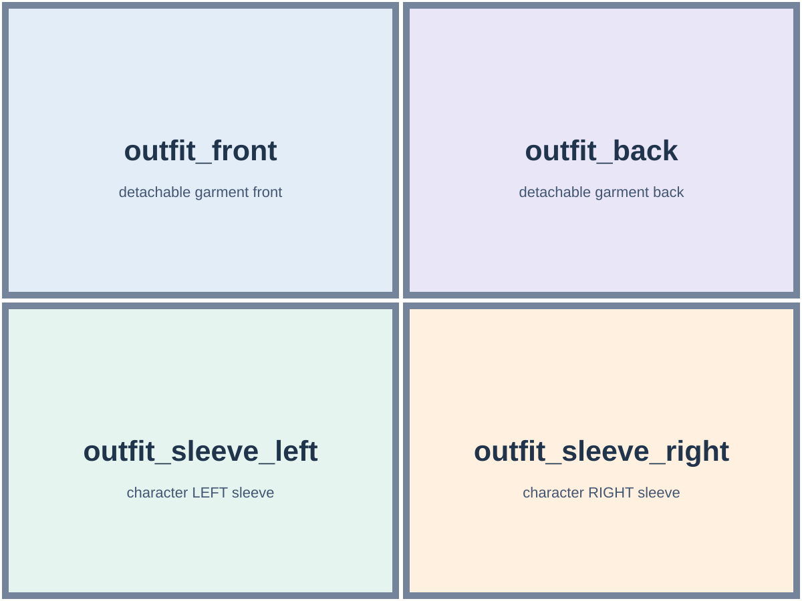

# VTuber Commercial Pipeline

[](https://colab.research.google.com/github/jujumelona/Virtual-pipeline/blob/main/notebooks/VTuber_Commercial_Pipeline_Colab_v8.ipynb)
[](LICENSE)
[](https://www.python.org/)

외부 이미지 생성 AI가 만든 캐릭터 이미지를 입력받아 **Inochi2D**, **Live2D**, **3D VRM** 모델을 제작합니다. 모드별 이미지 생성 사양과 프롬프트는 아래에 정리되어 있습니다.

## Live2D FREE/PRO 이미지·PSD 제작 (현재 구현)

**Live2D 출력은 수정 가능한 레이어 PSD + 파츠별 RGBA PNG·알파 마스크 + 프리뷰 + 실제 좌표/레이어 목록 JSON + See-through 원본 PSD·입력 이미지 + 모드별 자동 작성 제작 안내 MD + 시각 검수 MD + Cubism Editor 안내 README**입니다. 실제 ArtMesh, 디포머, 키폼, 물리와 모션, .cmo3 및 .moc3는 **사용자가 Cubism Editor에서 제작**합니다. Linux Colab에서 Editor나 MOC3 제작기가 자동 실행되는 것으로 표시하지 않습니다.

### 입력과 출력

| 모드 | 업로드 | 최종 ZIP 내 PSD |
|---|---|---|
| FREE 상반신 | 헤어·얼굴·의상·액세서리 착용 완성 이미지 1장: free_upper_master.png | avatar.psd |
| FREE 전신 | 같은 형식의 전신 완성 이미지 1장: free_full_master.png | avatar.psd |
| PRO 신체 | 의상·탈착 헤어 없는 불투명 신체/얼굴 원본 1장: pro_upper_base_master.png 등 | body.psd |
| PRO 헤어 | pro_upper_hair_variant.png 등 자산 1장 + 기존 base_master.png | hair.psd |
| PRO 의상 | pro_upper_outfit_variant.png 등 자산 1장 + 기존 base_master.png | outfit.psd |
| PRO 액세서리 | pro_upper_accessories_variant.png 등 자산 1장 + 기존 base_master.png | accessory.psd |

PRO 독립 제작은 네 종류를 한꺼번에 업로드하거나 만들어야 하는 방식이 **아닙니다**. 상반신은 upper, 전신은 full로 구분합니다. 기존 베이스 이미지는 자산의 **캔버스 크기 검증과 최종 PSD 합성의 중첩 검토**에 사용합니다. 이것만으로 픽셀 수준 위치 정합까지 입증했다고 주장하지 않습니다.

### Colab 셀

1. ② TOP_MODE = live2d 상위 모드 선택
2. ③ FREE/PRO 선택, PRO일 때 독립 제작 종류(body / hair / outfit / accessory) 한 종류 선택, 상반신/전신 및 Qwen 옵션 선택
3. ⑦ See-through NF4 준비, 필요 시 양자화 Qwen-Image-Layered + Stable-Layers 준비
4. ⑧ FREE는 완성 이미지 1장, PRO는 선택 자산 1장과 (분리 자산일 때만) 신체 기준 1장 업로드
5. ⑨ FREE/PRO 신체는 See-through 분해, PRO 헤어·의상·액세서리는 원본 알파 또는 Qwen 전경 마스크 → Qwen 선택적 재귀 분할 → 원본 픽셀 유지 → 독립 PSD/PNG ZIP 제작
6. ⑩ 최종 ZIP 다운로드. 실제 리깅·물리는 Editor에서 제작

### FREE 7개 제한

ArtMesh 100개, 파츠 폴더 30개, 디포머 50개, 파라미터 총 30개(블렌드셰이프 포함), 그중 블렌드셰이프 파라미터 최대 3개, ArtPath 3개, 텍스처 아틀라스 2048px 한 장.

FREE에서는 유용한 분리 파츠를 100개 한도에 최대한 활용하되, 100개를 채우려고 의미 없는 조각을 강제 생성하지 않습니다. PRO에 FREE 제한을 걸지 않습니다. **현재 PSD 단계에서는 후보 레이어 수·그룹 수와 알파 경계 사각형 텍스처 면적을 확인합니다. TEXTURE_BUDGET.md와 metadata/texture_budget.json은 배율의 필요조건만 보여주며, 실제 Editor 객체 제한 및 텍스처 패킹은 사용자가 Editor에서 검증**해야 합니다.

### See-through·Qwen과 시각적 품질

[2D 프로그램별 공식 원화·좌표·출력 규격](docs/TWO_D_OFFICIAL_INPUT_SPEC_2026-10-10.md): Cubism FREE/PRO, VTube Studio, Inochi2D의 픽셀·알파·좌표·스타일 기준과 자체 설정을 구분합니다.

**2:3은 원화 구도이며 모델의 공식 필수 입력 비율이 아닙니다.** 생성기에서 실제 native 크기/비율 옵션을 선택하고, PRO 분리 자산은 신체 기준과 같은 캔버스를 사용하세요. See-through는 내부 정사각 패딩·1280px, Stable-Layers는 긴 변 640px·16배수 반올림으로 처리합니다. 외부 생성 모델이 지정되지 않아 해당 모델의 steps/CFG를 공식값으로 강제하지 않습니다.

See-through는 공식 분해 기본값인 1280px / 30 steps / 깊이 768px을 명시적으로 사용합니다. 이는 **최종 원본 화소 복원까지 보장하는 값이 아니며**, T4 환경에서는 모델 실행 성공과 이미지 품질을 검증해야 합니다. See-through의 기본 의미 레이어 분리 개수는 Cubism의 실제 ArtMesh 수와 같지 않습니다. Qwen per-pass 출력은 **Colab ③ 옵션에서 2~10개(기본 최대 6개)**, 재귀 시도는 **0~12회(기본 최대 8회)** 선택할 수 있고 부위별 분할 후보 수를 달리합니다. 재귀 깊이는 최대 3단계입니다. 저해상도 Qwen RGB를 최종 이미지에 덮어쓰지 않고 See-through의 고해상도 RGBA 화소를 보존하며, 무효한 분해는 버립니다. 최종 결과 PSD에 채택된 파츠만 넣습니다. 부위별로 첫 시도를 배분한 다음 추가 재귀를 진행해 큰 헤어만 반복하는 것을 방지합니다. See-through의 정사각형 패딩을 역으로 적용해 최종 PSD를 입력 원본의 캔버스 좌표로 되돌립니다. 크기 복원은 생성 과정에서 손실된 RGB 디테일 복원의 증명이 아닙니다. 모델 준비 단계의 다운로드와 추론에 전체 시간 제한·로그를 적용하며, 제작 중에는 준비된 로컬 모델만 사용합니다.

특정 GPU·드라이버·모델 조합에서 추론 결과와 방송 퀄리티가 검증됐다고 주장하지 않습니다. Stable-Layers 사용 시 공급자 라이선스 조건을 따릅니다.

PRO 헤어·의상·액세서리는 얼굴이 없는 독립 자산이므로 전체 캐릭터용 See-through 신체→머리 추론에 넣지 않습니다. 투명 원본의 RGB·알파·캔버스를 보존하고 선택적으로 Qwen 재귀 분할을 적용합니다. 불투명 배경 원본은 Qwen 전경 레이어의 알파만 사용하며, 이 초기 배경 분리도 선택한 Qwen 시도 한도에 포함됩니다. Qwen이 꺼져 있으면 불투명 독립 자산은 실제 투명 원본이나 정합된 외부 PSD가 필요합니다. 이 경로는 가려진 헤어 뿌리·의상 뒷면을 새로 복원하지 않으므로 실제 이동 검수와 원화 보완이 필요합니다. 생성 RGB를 원본 대신 사용하는 방식으로 해상도·색상·선화를 바꾸지 않습니다.

### Cubism Editor 작업

모든 Live2D 결과·프롬프트 ZIP에 `OFFICIAL_EDITOR_SETTINGS.md`를 포함합니다. 표준 파라미터 ID/최소·기본·최대, 물리 계산 FPS 권장, PSD 규격과 Editor 작업 순서를 참고하세요. 실제 리깅 설정은 사용자가 Editor에서 적용합니다.

최종 PSD는 RGB·8-bit·sRGB 프로필과 레이어 자체 투명도 채널로 저장하며 별도 사용자 마스크를 남기지 않습니다. 입력에 sRGB가 아닌 ICC 프로필이 있으면 색상 바이트를 잘못 재해석하지 않도록 중단합니다. 이미지 편집기에서 sRGB로 변환한 원본을 사용하세요. 외부 PSD의 효과·혼합·그룹 불투명도는 미리 적용해 일반 픽셀 레이어로 준비해야 합니다. 실제 Cubism Editor 가져오기 결과는 별도 확인이 필요합니다.

[이미지·업스케일러·버추얼 프로그램별 세부 공식 설정 감사표](docs/VIRTUAL_OFFICIAL_SETTINGS_AUDIT_2026-10-10.md)도 함께 확인하세요.

[모델별·10개 모드별 공식 방식과 품질 점검](docs/LIVE2D_OFFICIAL_QUALITY_AUDIT_2026-10-10.md): 공식 설정, NF4 변경점, 이번 수정 및 실제 GPU·Editor 검증이 필요한 항목을 기록했습니다.

압축 안의 README_CUBISM.md에 따라 PSD의 레이어 순서와 알파 확인 → 메시 생성 → 디포머·표정·파라미터 키폼 구성 → 헤어·의상 흔들림 물리 적용 → .cmo3 저장 → 공식 .moc3 출력 → VTube Studio 검사 순으로 사용합니다. **PSD 내보내기는 방송용 리깅 완료와 다릅니다.**


## 모드별 이미지 생성 — 영구 베이스 캐릭터와 교체형 의상 분리

**2D와 3D 제작 방식은 서로 다릅니다.** 2D는 **헤어·교체 의상이 없는 방송용 기본 캐릭터 20파츠**를 먼저 제작하고, 헤어(`hair_variant.png`)와 교체 의상(`outfit_variant.png`)을 별도 파츠로 추가합니다. 기본 캐릭터는 **살구색 등 지정한 피부 톤의 불투명한 심리스 모션캡처 베이스웨어**로 신체를 완전히 덮습니다. 얼굴·목·손은 자연 피부색, 베이스웨어는 같은 `{skin_color}` 색상으로 표현하되 회색 슈트·의상 봉제선·칼라·지퍼 등은 넣지 않습니다. 3D도 **같은 색의 전신 커버를 착용한 비노골적 방송용 캐릭터**를 정면·후면·좌·우 시점으로 생성하고, 해당 외형을 VRM으로 복원·리깅합니다. 2D와 달리 3D 헤어스타일은 현재 복원 경로를 위해 참조 이미지에 남깁니다. **별도 의상 메시 자동 생성·피팅·교체는 아직 지원하지 않습니다.**

이미지 AI에게 고정 픽셀 크기를 강요하지 않습니다. *각 프롬프트에 출력 파일명, 가로:세로 비율, 파츠 배치, 좌우, 첨부할 참조 이미지가 전부 명시되어 있습니다.* 생성된 다운로드 파일의 이름이 다르면 ZIP을 만들기 전에 반드시 명시된 이름으로 저장/변경합니다. 투명도는 실제 RGBA여야 하며, 배경이 그려진 이미지나 파츠 칸에 전체 캐릭터가 있는 이미지는 비율 조정·업스케일링으로 수정할 수 없습니다.

### ① 캐릭터 생성 — 2D: PNG 7장 (기준 1 + 신체·얼굴 시트 6)

순서: `front_master.png` 생성 → 그 이미지를 **모든 후속 프롬프트에 반드시 첨부** → 각 배치 가이드도 추가 첨부 → 출력 PNG의 비율·RGBA·각 칸의 파츠 확인 → ZIP 압축.

#### `front_master.png` — 불투명 피부색 베이스웨어·헤어 분리형 정면 기준

**이미지 비율: 2:3 세로형.** 전신이 아닌 2D 방송용 상반신 중심 참조(머리, 목, 몸통, 양팔과 손이 보여야 함).

```text
ORIGINAL VTUBER CHARACTER (fill in braces):
Gender / presentation: {gender}
Hair color / HEX: {hair_color}
Hairstyle, ornaments: {hairstyle}
Eye shape, iris, pupils: {eyes}
Facial structure, ears, distinguishing features: {face}
Skin tone / matching opaque basewear color / exact HEX: {skin_color}
Body type, anatomy and proportions: {body}
Palette / exact HEX swatches: {palette}
Permanent identity details: {identity_details}

TASK — create and SAVE the output file EXACTLY as front_master.png.
OUTPUT: ONE portrait anime VTuber reference, WIDTH:HEIGHT=2:3.
Render at your model's best native resolution; no forced pixel number.
Same neutral upright front pose; face centered, eyes open, lips closed.
Head, shoulders, torso, forearms, hands readable, intended 2D rig area
fully inside the canvas. Same identity will be locked in future sheets.
NO removable hairstyle, bangs, locks, wig or head hair in this
BASE reference (draw the uncovered scalp/head instead). The listed
hairstyle is an identity specification reserved for hair_variant.png.
THIS IS A FULLY COVERED ADULT ANIME VTUBER PRODUCTION MODEL,
for Live2D/Inochi2D rigging and later separate fashion and hair assets.
The face, neck and visible hands have the natural skin tone {skin_color}.
The shoulders, chest, torso and arms wear a fully opaque, seamless,
non-removable PRODUCTION BASE COVER in the matching {skin_color}.
The base cover is plain and smooth, with no gray, texture, stitching,
collar, zipper, panels, logos or visible garment edges.
It must read as an intentionally clothed, family-friendly digital
avatar reference with simplified covered body contours, not exposed skin.
Draw no separately styled jacket, shirt, fashion outfit or accessories.
Hair is a distinct future asset; show a smooth uncovered scalp here.
Later costume parts must be authored as independent transparent assets;
the production cover is simply the permanent covered reference surface.
Do not generate a collage, labels, guides, text, or grid cells.
```

#### `sheet_face_base.png` — 얼굴·귀·목

**비율 1:1 · 2 columns x 2 rows.** 모델이 직접 출력 가능한 고해상도로 생성하고, 픽셀 크기는 Colab에서 정규화합니다.


[배치 가이드 별도로 열기](docs/sheet_guides/sheet_face_base_layout.svg)

**이 이미지 전용 복사용 프롬프트**

```text
ORIGINAL VTUBER CHARACTER (fill in braces):
Gender / presentation: {gender}
Hair color / HEX: {hair_color}
Hairstyle, ornaments: {hairstyle}
Eye shape, iris, pupils: {eyes}
Facial structure, ears, distinguishing features: {face}
Skin tone / matching opaque basewear color / exact HEX: {skin_color}
Body type, anatomy and proportions: {body}
Palette / exact HEX swatches: {palette}
Permanent identity details: {identity_details}

FULLY COVERED MODULAR VTUBER PRODUCTION CONTRACT:
This is the SAME character as the real attached front_master.png.
The base design includes a fully opaque seamless {skin_color} rigging
cover over all body surfaces except face, neck and visible hands.
This is intentionally a clothed, non-suggestive anime character asset.
The cover must be visually smooth, uniformly colored and featureless.
Avoid gray suit fabric, obvious cloth wrinkles, stitched panels, collar,
zipper, cuffs, colored outfit trim or garment boundaries.
Preserve natural face/neck/hand skin coloring and simplified covered
body contours. Never depict exposed torso or hips.
No independently styled clothing or hair in the permanent base.
Future removable costumes and hairstyle are separate image layers.
In FRONT view, character-left is viewer-right; NEVER mirror the person.
The attached colored grid diagram is only a LAYOUT GUIDE:
do NOT draw labels, borders, numbers, colors or a fake transparency grid.
Every filled cell contains only its named part with true alpha=0
elsewhere. Do not draw a complete character in a single-part tile.
Complete hidden artwork under hair/other body parts for animation.
Keep apparent anatomy and position consistent with the master.
Absolute alignment might still require visual/manual validation.

TASK — create and SAVE the output file EXACTLY as sheet_face_base.png.
SHEET OUTPUT: WIDTH:HEIGHT=1:1.
GRID: exactly 2 columns x 2 rows; all cells equal-sized.
Use the highest *native* resolution your image AI can generate.
Attach the ACTUAL front_master.png and sheet_face_base_layout.svg.
CELL ORDER:
row 1 col 1: ear_left
row 1 col 2: ear_right
row 2 col 1: neck
row 2 col 2: face
Skin/face base must NOT contain hair, eyeballs, iris, brow or mouth. Draw each ear individually, with occluded pieces completed.

All cells represent isolated segments in the SAME original character
coordinate frame. Every non-part pixel is true transparent alpha=0.
Do not print the requested filename or any labels on the picture.
Save/download as the exact filename sheet_face_base.png even if your AI's
automatically generated download name is different.
```

#### `sheet_eye_left.png` — 캐릭터 왼쪽 눈

**비율 1:1 · 2 columns x 2 rows.** 모델이 직접 출력 가능한 고해상도로 생성하고, 픽셀 크기는 Colab에서 정규화합니다.


[배치 가이드 별도로 열기](docs/sheet_guides/sheet_eye_left_layout.svg)

**이 이미지 전용 복사용 프롬프트**

```text
ORIGINAL VTUBER CHARACTER (fill in braces):
Gender / presentation: {gender}
Hair color / HEX: {hair_color}
Hairstyle, ornaments: {hairstyle}
Eye shape, iris, pupils: {eyes}
Facial structure, ears, distinguishing features: {face}
Skin tone / matching opaque basewear color / exact HEX: {skin_color}
Body type, anatomy and proportions: {body}
Palette / exact HEX swatches: {palette}
Permanent identity details: {identity_details}

FULLY COVERED MODULAR VTUBER PRODUCTION CONTRACT:
This is the SAME character as the real attached front_master.png.
The base design includes a fully opaque seamless {skin_color} rigging
cover over all body surfaces except face, neck and visible hands.
This is intentionally a clothed, non-suggestive anime character asset.
The cover must be visually smooth, uniformly colored and featureless.
Avoid gray suit fabric, obvious cloth wrinkles, stitched panels, collar,
zipper, cuffs, colored outfit trim or garment boundaries.
Preserve natural face/neck/hand skin coloring and simplified covered
body contours. Never depict exposed torso or hips.
No independently styled clothing or hair in the permanent base.
Future removable costumes and hairstyle are separate image layers.
In FRONT view, character-left is viewer-right; NEVER mirror the person.
The attached colored grid diagram is only a LAYOUT GUIDE:
do NOT draw labels, borders, numbers, colors or a fake transparency grid.
Every filled cell contains only its named part with true alpha=0
elsewhere. Do not draw a complete character in a single-part tile.
Complete hidden artwork under hair/other body parts for animation.
Keep apparent anatomy and position consistent with the master.
Absolute alignment might still require visual/manual validation.

TASK — create and SAVE the output file EXACTLY as sheet_eye_left.png.
SHEET OUTPUT: WIDTH:HEIGHT=1:1.
GRID: exactly 2 columns x 2 rows; all cells equal-sized.
Use the highest *native* resolution your image AI can generate.
Attach the ACTUAL front_master.png and sheet_eye_left_layout.svg.
CELL ORDER:
row 1 col 1: eye_left_white
row 1 col 2: eye_left_iris
row 2 col 1: eye_left_lid
row 2 col 2: brow_left
Draw separate sclera, isolated iris/pupil disk and highlight, blink-ready lid shape, and brow. This is CHARACTER left, viewer right.

All cells represent isolated segments in the SAME original character
coordinate frame. Every non-part pixel is true transparent alpha=0.
Do not print the requested filename or any labels on the picture.
Save/download as the exact filename sheet_eye_left.png even if your AI's
automatically generated download name is different.
```

#### `sheet_eye_right.png` — 캐릭터 오른쪽 눈

**비율 1:1 · 2 columns x 2 rows.** 모델이 직접 출력 가능한 고해상도로 생성하고, 픽셀 크기는 Colab에서 정규화합니다.


[배치 가이드 별도로 열기](docs/sheet_guides/sheet_eye_right_layout.svg)

**이 이미지 전용 복사용 프롬프트**

```text
ORIGINAL VTUBER CHARACTER (fill in braces):
Gender / presentation: {gender}
Hair color / HEX: {hair_color}
Hairstyle, ornaments: {hairstyle}
Eye shape, iris, pupils: {eyes}
Facial structure, ears, distinguishing features: {face}
Skin tone / matching opaque basewear color / exact HEX: {skin_color}
Body type, anatomy and proportions: {body}
Palette / exact HEX swatches: {palette}
Permanent identity details: {identity_details}

FULLY COVERED MODULAR VTUBER PRODUCTION CONTRACT:
This is the SAME character as the real attached front_master.png.
The base design includes a fully opaque seamless {skin_color} rigging
cover over all body surfaces except face, neck and visible hands.
This is intentionally a clothed, non-suggestive anime character asset.
The cover must be visually smooth, uniformly colored and featureless.
Avoid gray suit fabric, obvious cloth wrinkles, stitched panels, collar,
zipper, cuffs, colored outfit trim or garment boundaries.
Preserve natural face/neck/hand skin coloring and simplified covered
body contours. Never depict exposed torso or hips.
No independently styled clothing or hair in the permanent base.
Future removable costumes and hairstyle are separate image layers.
In FRONT view, character-left is viewer-right; NEVER mirror the person.
The attached colored grid diagram is only a LAYOUT GUIDE:
do NOT draw labels, borders, numbers, colors or a fake transparency grid.
Every filled cell contains only its named part with true alpha=0
elsewhere. Do not draw a complete character in a single-part tile.
Complete hidden artwork under hair/other body parts for animation.
Keep apparent anatomy and position consistent with the master.
Absolute alignment might still require visual/manual validation.

TASK — create and SAVE the output file EXACTLY as sheet_eye_right.png.
SHEET OUTPUT: WIDTH:HEIGHT=1:1.
GRID: exactly 2 columns x 2 rows; all cells equal-sized.
Use the highest *native* resolution your image AI can generate.
Attach the ACTUAL front_master.png and sheet_eye_right_layout.svg.
CELL ORDER:
row 1 col 1: eye_right_white
row 1 col 2: eye_right_iris
row 2 col 1: eye_right_lid
row 2 col 2: brow_right
Use the same iris style as the left eye, but draw the character-right eye on viewer-left. No duplication of the full face.

All cells represent isolated segments in the SAME original character
coordinate frame. Every non-part pixel is true transparent alpha=0.
Do not print the requested filename or any labels on the picture.
Save/download as the exact filename sheet_eye_right.png even if your AI's
automatically generated download name is different.
```

#### `sheet_mouth.png` — 코·닫힌 입·열린 입

**비율 1:1 · 2 columns x 2 rows.** 모델이 직접 출력 가능한 고해상도로 생성하고, 픽셀 크기는 Colab에서 정규화합니다.


[배치 가이드 별도로 열기](docs/sheet_guides/sheet_mouth_layout.svg)

**이 이미지 전용 복사용 프롬프트**

```text
ORIGINAL VTUBER CHARACTER (fill in braces):
Gender / presentation: {gender}
Hair color / HEX: {hair_color}
Hairstyle, ornaments: {hairstyle}
Eye shape, iris, pupils: {eyes}
Facial structure, ears, distinguishing features: {face}
Skin tone / matching opaque basewear color / exact HEX: {skin_color}
Body type, anatomy and proportions: {body}
Palette / exact HEX swatches: {palette}
Permanent identity details: {identity_details}

FULLY COVERED MODULAR VTUBER PRODUCTION CONTRACT:
This is the SAME character as the real attached front_master.png.
The base design includes a fully opaque seamless {skin_color} rigging
cover over all body surfaces except face, neck and visible hands.
This is intentionally a clothed, non-suggestive anime character asset.
The cover must be visually smooth, uniformly colored and featureless.
Avoid gray suit fabric, obvious cloth wrinkles, stitched panels, collar,
zipper, cuffs, colored outfit trim or garment boundaries.
Preserve natural face/neck/hand skin coloring and simplified covered
body contours. Never depict exposed torso or hips.
No independently styled clothing or hair in the permanent base.
Future removable costumes and hairstyle are separate image layers.
In FRONT view, character-left is viewer-right; NEVER mirror the person.
The attached colored grid diagram is only a LAYOUT GUIDE:
do NOT draw labels, borders, numbers, colors or a fake transparency grid.
Every filled cell contains only its named part with true alpha=0
elsewhere. Do not draw a complete character in a single-part tile.
Complete hidden artwork under hair/other body parts for animation.
Keep apparent anatomy and position consistent with the master.
Absolute alignment might still require visual/manual validation.

TASK — create and SAVE the output file EXACTLY as sheet_mouth.png.
SHEET OUTPUT: WIDTH:HEIGHT=1:1.
GRID: exactly 2 columns x 2 rows; all cells equal-sized.
Use the highest *native* resolution your image AI can generate.
Attach the ACTUAL front_master.png and sheet_mouth_layout.svg.
CELL ORDER:
row 1 col 1: nose
row 1 col 2: mouth_closed
row 2 col 1: mouth_open
row 2 col 2: EMPTY
Mouth-open/closed are two animation states. Show full tongue, teeth, inner mouth for the open state. The EMPTY tile alpha must be zero.

All cells represent isolated segments in the SAME original character
coordinate frame. Every non-part pixel is true transparent alpha=0.
Do not print the requested filename or any labels on the picture.
Save/download as the exact filename sheet_mouth.png even if your AI's
automatically generated download name is different.
```

#### `sheet_body_base.png` — 불투명 심리스 신체 커버 베이스

**비율 2:3 · 1 column x 1 row.** 모델이 직접 출력 가능한 고해상도로 생성하고, 픽셀 크기는 Colab에서 정규화합니다.



[배치 가이드 별도로 열기](docs/sheet_guides/sheet_body_base_layout.svg)

**이 이미지 전용 복사용 프롬프트**

```text
ORIGINAL VTUBER CHARACTER (fill in braces):
Gender / presentation: {gender}
Hair color / HEX: {hair_color}
Hairstyle, ornaments: {hairstyle}
Eye shape, iris, pupils: {eyes}
Facial structure, ears, distinguishing features: {face}
Skin tone / matching opaque basewear color / exact HEX: {skin_color}
Body type, anatomy and proportions: {body}
Palette / exact HEX swatches: {palette}
Permanent identity details: {identity_details}

FULLY COVERED MODULAR VTUBER PRODUCTION CONTRACT:
This is the SAME character as the real attached front_master.png.
The base design includes a fully opaque seamless {skin_color} rigging
cover over all body surfaces except face, neck and visible hands.
This is intentionally a clothed, non-suggestive anime character asset.
The cover must be visually smooth, uniformly colored and featureless.
Avoid gray suit fabric, obvious cloth wrinkles, stitched panels, collar,
zipper, cuffs, colored outfit trim or garment boundaries.
Preserve natural face/neck/hand skin coloring and simplified covered
body contours. Never depict exposed torso or hips.
No independently styled clothing or hair in the permanent base.
Future removable costumes and hairstyle are separate image layers.
In FRONT view, character-left is viewer-right; NEVER mirror the person.
The attached colored grid diagram is only a LAYOUT GUIDE:
do NOT draw labels, borders, numbers, colors or a fake transparency grid.
Every filled cell contains only its named part with true alpha=0
elsewhere. Do not draw a complete character in a single-part tile.
Complete hidden artwork under hair/other body parts for animation.
Keep apparent anatomy and position consistent with the master.
Absolute alignment might still require visual/manual validation.

TASK — create and SAVE the output file EXACTLY as sheet_body_base.png.
SHEET OUTPUT: WIDTH:HEIGHT=2:3.
GRID: exactly 1 column x 1 row; all cells equal-sized.
Use the highest *native* resolution your image AI can generate.
Attach the ACTUAL front_master.png and sheet_body_base_layout.svg.
CELL ORDER:
row 1 col 1: body
Only the fully opaque {skin_color} covered BODY silhouette of the original VTuber, with smooth plain production base-cover material. Render covered chest and hips with simplified contours. No exposed skin on torso; no seams, zippers, collars or fashion decoration. Isolate this one rigging body part.

All cells represent isolated segments in the SAME original character
coordinate frame. Every non-part pixel is true transparent alpha=0.
Do not print the requested filename or any labels on the picture.
Save/download as the exact filename sheet_body_base.png even if your AI's
automatically generated download name is different.
```

#### `sheet_arms_hands.png` — 동일한 피부색 커버 양팔·피부색 양손

**비율 4:3 · 2 columns x 2 rows.** 모델이 직접 출력 가능한 고해상도로 생성하고, 픽셀 크기는 Colab에서 정규화합니다.


[배치 가이드 별도로 열기](docs/sheet_guides/sheet_arms_hands_layout.svg)

**이 이미지 전용 복사용 프롬프트**

```text
ORIGINAL VTUBER CHARACTER (fill in braces):
Gender / presentation: {gender}
Hair color / HEX: {hair_color}
Hairstyle, ornaments: {hairstyle}
Eye shape, iris, pupils: {eyes}
Facial structure, ears, distinguishing features: {face}
Skin tone / matching opaque basewear color / exact HEX: {skin_color}
Body type, anatomy and proportions: {body}
Palette / exact HEX swatches: {palette}
Permanent identity details: {identity_details}

FULLY COVERED MODULAR VTUBER PRODUCTION CONTRACT:
This is the SAME character as the real attached front_master.png.
The base design includes a fully opaque seamless {skin_color} rigging
cover over all body surfaces except face, neck and visible hands.
This is intentionally a clothed, non-suggestive anime character asset.
The cover must be visually smooth, uniformly colored and featureless.
Avoid gray suit fabric, obvious cloth wrinkles, stitched panels, collar,
zipper, cuffs, colored outfit trim or garment boundaries.
Preserve natural face/neck/hand skin coloring and simplified covered
body contours. Never depict exposed torso or hips.
No independently styled clothing or hair in the permanent base.
Future removable costumes and hairstyle are separate image layers.
In FRONT view, character-left is viewer-right; NEVER mirror the person.
The attached colored grid diagram is only a LAYOUT GUIDE:
do NOT draw labels, borders, numbers, colors or a fake transparency grid.
Every filled cell contains only its named part with true alpha=0
elsewhere. Do not draw a complete character in a single-part tile.
Complete hidden artwork under hair/other body parts for animation.
Keep apparent anatomy and position consistent with the master.
Absolute alignment might still require visual/manual validation.

TASK — create and SAVE the output file EXACTLY as sheet_arms_hands.png.
SHEET OUTPUT: WIDTH:HEIGHT=4:3.
GRID: exactly 2 columns x 2 rows; all cells equal-sized.
Use the highest *native* resolution your image AI can generate.
Attach the ACTUAL front_master.png and sheet_arms_hands_layout.svg.
CELL ORDER:
row 1 col 1: arm_left
row 1 col 2: arm_right
row 2 col 1: hand_left
row 2 col 2: hand_right
Arms: the identical opaque {skin_color} seamless production cover. Hands: natural {skin_color} skin. Keep the arm-to-hand transition understated with no cuffs, stitching, bracelets or costume accessories. Output only the four requested part cells.

All cells represent isolated segments in the SAME original character
coordinate frame. Every non-part pixel is true transparent alpha=0.
Do not print the requested filename or any labels on the picture.
Save/download as the exact filename sheet_arms_hands.png even if your AI's
automatically generated download name is different.
```

#### 캐릭터 2D ZIP (캐릭터 제작 시)

```text
character_2d_sheet_pack.zip
└── character_2d_sheet_pack/
    ├── front_master.png
    ├── sheet_face_base.png
    ├── sheet_eye_left.png
    ├── sheet_eye_right.png
    ├── sheet_mouth.png
    ├── sheet_body_base.png
    └── sheet_arms_hands.png
```

**중요:** 이 ZIP에는 헤어·옷 이미지(`hair_front/back/left/right`, `outfit_front/back`)가 포함되면 안 됩니다. 완성 스타일은 후속 2D 헤어·의상 추가 단계에서 제작합니다. 2D 베이스는 20개의 독립 신체·얼굴 파츠로 구성하고 실제 옷은 별도 액세서리/의상 모드에서 만듭니다.

### ① 캐릭터 생성 — 3D 불투명 피부색 커버 베이스 (전신 시트 2장 + 얼굴 1장)

**목적:** 이미지 생성 AI가 노출 신체로 해석하지 않도록 **전신을 덮는 불투명하고 단색의 심리스 VTuber 제작용 베이스웨어**를 사용합니다. 베이스웨어 색은 `{skin_color}`이며 얼굴·목·손의 피부색과 맞춥니다. 회색 슈트, 봉제선, 목 칼라, 지퍼, 원단 패턴을 생성하지 않습니다. 현행 3D 경로는 입력 외형을 하나의 아바타 메시로 복원하므로 이 커버 또한 **베이스 아바타 텍스처/외형에 통합**됩니다. 독립 의상 자동 모델링·피팅·탈착은 지원하지 않습니다. 교체할 옷은 따로 모델링·리깅해야 합니다.

**2D와 3D의 머리카락 차이:** 2D 기본 마스터는 별도 헤어 파츠를 만들기 위해 무모(머리카락 없는 두피)입니다. 현재 3D는 입력 이미지에서 머리 형상을 재구성하므로 3D 정면·후면·측면 및 얼굴에는 **동일한 헤어스타일**을 표시합니다. 3D 머리카락 교체 자동화까지 보장한다는 뜻은 아닙니다.

| 필요한 이미지 | 권장 비율 | 내용 | 출력 파일명 |
|---|---|---|---|
| 1장 | 전체 4:3 / 각 칸 2:3 | 불투명 피부색 베이스웨어 캐릭터 정면·후면 2뷰 | `sheet_front_back.png` |
| 1장 | 전체 4:3 / 각 칸 2:3 | 같은 베이스 신체 좌·우 2뷰 | `sheet_side_views.png` |
| 1장 | 1:1 | 동일 캐릭터의 얼굴 확대 | `face.png` |

**필수 3장 (4방향 전신 4뷰 + 얼굴 1뷰).** 인위적으로 출력 픽셀 크기를 고정하지 말고 이미지 AI의 네이티브 해상도로 제작합니다. 후속 시점에는 실제 생성한 이전 참조를 첨부하고, 색상과 체형이 일치하는지 확인합니다.

#### `sheet_front_back.png` — 피부색 전신 커버 정면·후면

**배치도: 가로 4:3, 2열 × 1행.** 첫 3D 이미지로 생성합니다.


[배치도 원본](docs/sheet_guides/sheet_front_back_layout.svg)

**완결된 복사용 프롬프트**

```text
ORIGINAL ADULT ANIME VTUBER — PERMANENT 3D IDENTITY (FILL BRACES):
Gender / presentation: {gender}
Hair color / style / bangs / ornaments: {hairstyle}
Eye shape / iris / pupils: {eyes}
Facial structure / ears / distinguishing marks: {face}
Natural skin / matching opaque basewear / exact HEX: {skin_color}
Body proportions / height / silhouette: {body}
Other permanent identity details: {identity_details}

FILE NAME AND OUTPUT:
Generate ONE PNG. Save or rename EXACTLY to sheet_front_back.png.
ASPECT RATIO width:height=4:3, TWO equal-width cells, ONE row.
Each cell is portrait width:height=2:3.
CELL LEFT: FRONT full-body skin-colored base view.
CELL RIGHT: BACK full-body skin-colored base view.
Attach sheet_front_back_layout.svg as a layout guide ONLY.

PRODUCTION PURPOSE — FULLY COVERED 3D VTUBER RIGGING MODEL:
Create one original ADULT anime VTuber as an intentionally clothed,
family-friendly 3D animation reference, ready for later VRM rigging.
Face, neck and hands use natural skin tone {skin_color}. A FULLY OPAQUE
seamless full-body production cover encloses shoulders, chest, torso,
arms, hips, legs and feet, colored the SAME {skin_color}.
This cover is a smooth, matte, textureless rigging base, with a neutral
silhouette, no gray fabric, seams, wrinkles, zippers, cuffs, collar,
graphics or layered fashion details. All body areas remain covered.
This is a clothed character, not a realistic anatomy or exposure study.
No decorative outfit is included: separate future wardrobe pieces
will require independently produced garment meshes and skin weights.
Retain the SAME specified hairstyle across all 3D reconstruction views.
Use the SAME neutral symmetric A-pose, arms gently separated, orthographic
eye-level camera, consistent scale, body proportions and flat lighting.
Character LEFT and RIGHT refer to anatomical directions, not screen sides.
Rotate for back/side views; never mirror the front as a substitute.
All hair, head, hands and covered feet fit in each full-body tile.
Use native image resolution and a plain contrasting background.
No props, text, watermark, borders or visible layout guides.

This is the FIRST 3D image; no earlier character image is required.
Both cells show one fully covered character in the same seamless basewear.
```

#### `sheet_side_views.png` — 같은 전신 커버 좌·우 측면

**배치도: 가로 4:3, 2열 × 1행.** 앞서 만든 실제 `sheet_front_back.png`를 반드시 함께 첨부합니다.


[배치도 원본](docs/sheet_guides/sheet_side_views_layout.svg)

**완결된 복사용 프롬프트**

```text
ORIGINAL ADULT ANIME VTUBER — PERMANENT 3D IDENTITY (FILL BRACES):
Gender / presentation: {gender}
Hair color / style / bangs / ornaments: {hairstyle}
Eye shape / iris / pupils: {eyes}
Facial structure / ears / distinguishing marks: {face}
Natural skin / matching opaque basewear / exact HEX: {skin_color}
Body proportions / height / silhouette: {body}
Other permanent identity details: {identity_details}

FILE NAME AND OUTPUT:
Generate ONE PNG. Save or rename EXACTLY to sheet_side_views.png.
ASPECT RATIO width:height=4:3, TWO equal-width cells, ONE row.
Each cell is portrait width:height=2:3.
CELL LEFT: CHARACTER LEFT SIDE full-body skin-colored base view.
CELL RIGHT: CHARACTER RIGHT SIDE full-body skin-colored base view.
ATTACH the REAL previously generated sheet_front_back.png and
sheet_side_views_layout.svg as separate visual references.

PRODUCTION PURPOSE — FULLY COVERED 3D VTUBER RIGGING MODEL:
Create one original ADULT anime VTuber as an intentionally clothed,
family-friendly 3D animation reference, ready for later VRM rigging.
Face, neck and hands use natural skin tone {skin_color}. A FULLY OPAQUE
seamless full-body production cover encloses shoulders, chest, torso,
arms, hips, legs and feet, colored the SAME {skin_color}.
This cover is a smooth, matte, textureless rigging base, with a neutral
silhouette, no gray fabric, seams, wrinkles, zippers, cuffs, collar,
graphics or layered fashion details. All body areas remain covered.
This is a clothed character, not a realistic anatomy or exposure study.
No decorative outfit is included: separate future wardrobe pieces
will require independently produced garment meshes and skin weights.
Retain the SAME specified hairstyle across all 3D reconstruction views.
Use the SAME neutral symmetric A-pose, arms gently separated, orthographic
eye-level camera, consistent scale, body proportions and flat lighting.
Character LEFT and RIGHT refer to anatomical directions, not screen sides.
Rotate for back/side views; never mirror the front as a substitute.
All hair, head, hands and covered feet fit in each full-body tile.
Use native image resolution and a plain contrasting background.
No props, text, watermark, borders or visible layout guides.

Rotate the same base avatar 90 degrees to its anatomical LEFT or RIGHT.
Match FRONT/BACK body proportions, {skin_color} cover color, hair,
face, covered feet and pose. Keep the identical plain basewear.
```

#### `face.png` — 같은 캐릭터의 얼굴 확대

**비율 1:1 정사각형.** 앞서 만든 `sheet_front_back.png`의 실제 정면 셀을 첨부합니다.

**완결된 복사용 프롬프트**

```text
ORIGINAL ADULT ANIME VTUBER — PERMANENT 3D IDENTITY (FILL BRACES):
Gender / presentation: {gender}
Hair color / style / bangs / ornaments: {hairstyle}
Eye shape / iris / pupils: {eyes}
Facial structure / ears / distinguishing marks: {face}
Natural skin / matching opaque basewear / exact HEX: {skin_color}
Body proportions / height / silhouette: {body}
Other permanent identity details: {identity_details}

FILE NAME AND OUTPUT:
Generate ONE PNG. Save or rename EXACTLY to face.png.
ASPECT RATIO width:height=1:1 (square).
ONE sharply detailed, front-facing orthographic close-up of the
SAME original adult anime VTuber's face and head.
ATTACH the real FRONT cell cropped from sheet_front_back.png.
This is NOT a body view or a multi-panel character sheet.

PRODUCTION PURPOSE — MATCH THE 3D VTUBER BASE IDENTITY:
Match the exact natural {skin_color} skin color from head to neck.
Preserve eyes, jaw, iris, eyelashes, scalp/hairstyle, facial markings,
ears and lighting from the first FRONT reference.
The existing 3D reconstruction can use the same hairstyle as the body
views; do not invent a different hairstyle or hair accessory.
Show the uncovered face and neck above the same simple covered
production outfit. Keep the shoulders covered just outside the crop.
No extra accessories, detailed fashion collars, scarf or gray fabric.
No full-body portrait, labels, grid, props, text or watermark.
```

#### 3D 캐릭터 업로드 ZIP

```text
character_3d_sheet_pack.zip
└── character_3d_sheet_pack/
    ├── sheet_front_back.png
    ├── sheet_side_views.png
    └── face.png
```

Colab ②에서 **캐릭터 생성 → 3d → 전신 다중 시점(기본값)**을 선택하고 ④에서 ZIP을 업로드합니다. ⑤에서 네 방향을 개별 컷으로 분할·정규화하여 3D 복원·텍스처·리깅으로 전달합니다. 출력물은 **피부색 불투명 베이스웨어가 통합된 VRM**이며 별도 교체형 의상은 포함되지 않습니다. 검증된 상업적 이용 가능 의상 모델을 나중에 별도 처리해야 하며, 이 파이프라인이 자동으로 옷을 피팅·스키닝하거나 전환하는 기능을 제공하지는 않습니다.

### ② 액세서리 제작 — 소품과 교체형 의상은 별개

정적 소품은 기존 액세서리 경로를 사용합니다. **옷은 정적 소품으로 붙이지 않습니다.** 2D는 별도 이미지 파츠+변형 메시, 3D는 별도 입체 의상 메시+본 스키닝이 필요합니다. [Live2D PSD 파츠 교체](https://docs.live2d.com/en/cubism-editor-manual/psd-import/) · [VRoid XAvatar](https://vroid.pixiv.help/hc/en-us/articles/39513162810649-What-is-XAvatar).

#### ②-1. 정적 소품 PNG (1~8장)

```text
TASK — create an individual transparent PNG named
accessory_{accessory_name}.png (one physical accessory per file).
Accessory type: {accessory_type}; material: {material}; colors: {colors}.
Single isolated 3D-looking object, clear attachment face and silhouette,
best native generation resolution, no avatar/body and no text.
Accessories can use the existing STATIC attach pipeline; clothing cannot.
```

#### `hair_variant.png` — 2D 추가·교체형 헤어 시트

**이미지 수 1장**, 비율 **2:3 세로형**, 2열 × 2행. 최초 베이스 ZIP에는 포함하지 않고, 의상 파츠와 같이 별도 제작합니다. 머리 모양의 변형 메쉬는 캐릭터와 합쳐 새 리깅 결과를 만들 때 생성하며, 방송 중 실시간 헤어 토글이 자동 완성되는 것은 아닙니다.


**복사용 프롬프트**

```text
CHARACTER IDENTITY:
Gender: {gender}
Face, ears and skin: {face}
Eyes and eyebrow style: {eyes}
Hair base color and exact HEX: {hair_color}
New hairstyle / bangs / length / accessories: {hairstyle}
Other identity notes: {identity_details}

TASK — create ONE image and SAVE it EXACTLY as hair_variant.png.
ASPECT RATIO WIDTH:HEIGHT=2:3; exactly 2 columns x 2 rows.
Row1 col1: hair_front (front bangs / fully extended hidden roots).
Row1 col2: hair_back (back hair / complete outline, hidden scalp).
Row2 col1: hair_left (character's LEFT, viewer RIGHT from front).
Row2 col2: hair_right (character's RIGHT, viewer LEFT from front).
Attach actual neutral front_master.png and sheet_hair_layout.svg.
Every cell contains ONLY its assigned HAIR PART as transparent
RGBA artwork; alpha=0 everywhere else. Do not draw a face,
anatomical body base, clothing, a person portrait, guide cells,
visible grid borders, captions or watermark.
Preserve all x/y placement relative to the attached front reference.
Generate at native supported image AI resolution; do NOT enforce
arbitrary absolute pixel dimensions. Rename AI output to hair_variant.png.
```

**Colab:** `② 액세서리 제작 → 2D 교체 의상`에서 헤어를 추가하려면 의상 이미지 `outfit_variant.png`와 **선택 사항**인 `hair_variant.png`를 함께 업로드합니다. 중립 베이스에 4개 헤어 및 4개 의상 레이어를 추가해 다시 리깅합니다.

#### `outfit_variant.png` — ②-2. 2D 의상 (별도 1장)

먼저 **이미 만든 중립 베이스 캐릭터의 `front_master.png`**를 참조로 넣고, 아래 배치도를 추가 첨부합니다. 이 시트는 **2열×2행, 전체 4:3** 비율입니다. 얼굴·머리·피부·몸통을 새로 생성하지 않습니다.



[배치 가이드 별도로 열기](docs/sheet_guides/outfit_variant_layout.svg)

**복사용 프롬프트 — 이 의상 이미지 하나에 필요한 내용 전부 포함**

```text
ORIGINAL VTUBER CHARACTER (fill in braces):
Gender / presentation: {gender}
Hair color / HEX: {hair_color}
Hairstyle, ornaments: {hairstyle}
Eye shape, iris, pupils: {eyes}
Facial structure, ears, distinguishing features: {face}
Skin tone / matching opaque basewear color / exact HEX: {skin_color}
Body type, anatomy and proportions: {body}
Palette / exact HEX swatches: {palette}
Permanent identity details: {identity_details}

NEW COSTUME: {costume_name}
Garment category / layers: {costume_type}
Fabric, panels, colors, cuffs, seams: {garment_design}
Accessory or ornament attached TO THIS OUTFIT: {garment_accessories}

TASK — create and SAVE the file EXACTLY as outfit_variant.png.
Separate, DETACHABLE 2D wardrobe parts for a preexisting character.
ATTACH the actual outfit-free front_master.png and the placement diagram
outfit_variant_layout.svg as references for identity/placement ONLY.
OUTPUT CANVAS WIDTH:HEIGHT = 4:3.
GRID exactly 2 columns x 2 rows, 4 equally sized rectangular cells.
row1 col1: outfit_front — torso FRONT garment panel (collar/chest/waist)
row1 col2: outfit_back — separate torso BACK fabric/panel
row2 col1: outfit_sleeve_left — character-LEFT garment sleeve
row2 col2: outfit_sleeve_right — character-RIGHT garment sleeve
TRUE transparent RGBA, with ALL four clothing parts independent.
Character-LEFT means VIEWER-RIGHT in an orthographic FRONT image.
Each garment part must fit the same neutral body/arm silhouette as
front_master.png and keep realistic overlap margins around shoulders.
Paint hidden fabric fully so 2D deformation reveals no holes.
NEVER render skin, hair, face, hands, body anatomy or a full character
within the garment cells. No grid borders or sheet labels in output.
Generate at the best native resolution; do not force pixel dimensions.
Save exact filename outfit_variant.png, rename the download if needed.
```

**2D 의상 제작 시 Colab 설정:** `② 작업 종류=액세서리 제작` → `세부 작업=2D 교체 의상`. ④에서 원래 `character_2d_sheet_pack.zip`과 의상 시트 `outfit_variant.png`를 업로드합니다. 완성 헤어가 필요하면 `hair_variant.png`도 같은 업로드에서 선택하세요. ⑤에서는 동일한 중립 베이스 **20파츠+의상 4파츠=24파츠** (헤어 시트도 함께 업로드하면 28파츠)로 새 편집·리깅 결과를 생성합니다. 의상별 메시와 움직임을 점검해야 하며, **방송 중 실시간 옷 스위치 파라미터가 자동 완성되는 것은 아닙니다.**

#### ②-3. 3D 외부 의상 교체 — 수동 편집기 전달만 지원 (고급)

현재 레포의 3D 자동 본선은 **입력 이미지의 외형을 하나의 VRM 메시로 복원**하며, 위 기본 프롬프트는 피부색의 전신 커버를 입힌 상태로 생성합니다. 3D 의상 자동 교체는 제공하지 않습니다. VRoid Studio의 별도 [Dress-up/XWear](https://vroid.pixiv.help/hc/en-us/articles/39512879834649-Introduction-to-VRoid-Studio-s-Dress-Up-Feature)는 외부 편집기 작업으로, 실제로 제작된 `costume.xwear`와 기준 `avatar.vrm`을 사용합니다. Colab의 **3D 교체 의상(XWear)**은 유효한 `base_avatar.vrm`과 `costume.xwear`를 받아 **편집기로 전달할 `vroid_dressup_handoff.zip`**만 구성합니다. 옷이 착용된 새로운 VRM을 자동 생성하지 않습니다. 의상이나 기존 바디슈트가 이미 통합된 VRM에서는 의상 관통·중복 메시 삭제 및 피팅을 외부 편집기에서 수행해야 합니다.

**피부색으로 완전히 덮인 3D 기본 캐릭터를 먼저 만들고, 별도로 제작된 의상 메시를 외부 편집기에서 피팅하는 방식입니다.** 단순 PNG 의상 참조 이미지를 XWear 원본이라고 주장하거나, 고정 본 액세서리를 몸이 구부러지는 의상으로 취급하지 않습니다.

## 작업 모드

| UI 모드 | 오픈소스 기반 준비 도구 | 현재 실제 출력 | 완성 방송 모델의 포맷 | 구현 상태 |
|---|---|---|---|---|
| **Inochi2D** | Florence-2 / SAM2 / FLUX + Inochi2D SDK | 실제 레이어 PSD/ORA, 메시·키폼·물리 JSON | `.inp` | **네이티브 구현 및 SDK E2E PASS**: 공식 0.8.7 SDK로 변형·물리 `.inp`를 실제 생성/재로딩. 입력 모델별 SDK 검증 성공 시에만 `complete`, 실패 시 `prepared` |
| **Live2D FREE/PRO** | See-through NF4 + 선택적 Qwen/Stable-Layers + 정식 Cubism Editor | 독립 PSD, RGBA PNG, 마스크, 검수 MD와 ZIP | `.moc3` + `.model3.json` + 텍스처/물리 | **needs_editor_export**: 공식 Editor에서 출력한 폴더만 검증·수집. 자동 MOC3 인코더 없음 |
| **3D VRM** | TripoSR, Depth Anything V2 Small, MakeHuman, Blender VRM Add-on | 피팅/텍스처/리깅 자료 및 검증 시 `avatar.vrm` + `avatar_rigged.blend` | `.vrm` | **상업용 모델 교체 반영**: InstantMesh 제외, MIT TripoSR 정면·후면·좌우 독립 복원으로 대체. 실제 Colab T4 E2E 검증은 별도 |

**2D 중간 준비 ZIP은 최종 모델이 아닙니다.** Inochi2D는 SDK가 검증한 `.inp`만 방송 모델로 인정하며, Live2D는 정식 Cubism Editor에서 내보낸 `.moc3`만 최종 모델로 인정합니다. 준비된 PSD/ORA는 보완·후속 수정을 위한 편집 자료입니다.

### Inochi2D

- 기본 시트 입력: `character_2d_sheet_pack.zip` (기준 이미지 1장 + 의상·헤어 없는 고해상도 시트 6장). 각 시트의 배치 그림과 복사용 프롬프트는 위 제작 가이드 참조.
- 현재 출력: `avatar.psd`, `avatar.ora`, `meshes2d.json`, `keyforms.json`, `physics2d.json`, `puppet_spec.json`. SDK 네이티브 출력에 성공한 경우에만 `avatar.inp`를 `complete`로 보고합니다.
- 네이티브 자동화: 공식 BSD-2 **Inochi2D SDK 0.8.7**의 실제 `MeshData`·`Part`·`DeformationParameterBinding`·`SimplePhysics`를 구성하고 SDK의 `inWriteINPPuppet`로 **실제 INP1**을 출력합니다. SDK로 다시 읽어 애니메이션·물리 바인딩을 검사합니다. 0.9 개발판은 현재 변형 바인딩이 비활성화되어 본선에 사용하지 않습니다.
- 실제 컴파일+SDK 네이티브 INP 재임포트 검증: [GitHub Actions PASS](https://github.com/jujumelona/Virtual-pipeline/actions/runs/37878238975). 이 검증은 SDK 프로그램의 정상 작동을 증명하며 **사용자별 AI 파츠 품질을 보증하지는 않습니다.**
- Colab Inochi2D 선택 시 DUB/LDC·SDL2/Xvfb 런타임을 준비합니다. CLI는 필요할 때 자동 SDK 빌드를 시도합니다. 유효한 실행 파일 또는 메시·키폼·물리 바인딩이 없으면 중간 PSD/ORA를 `prepared`로 반환하고, 네이티브 `.inp` 완성을 가장하지 않습니다. [공식 Inochi2D 문서](https://docs.inochi2d.com/en/latest/) 참조.

### Live2D

- FREE 입력: 헤어·의상·장식까지 착용한 완성 캐릭터 한 장. PRO 입력: body/hair/outfit/accessory 중 한 종류의 이미지와, 탈착 자산일 때만 신체 기준 한 장.
- 출력: FREE `avatar.psd`, PRO 선택 자산의 `body.psd` / `hair.psd` / `outfit.psd` / `accessory.psd`와 PNG·마스크·비교 이미지·제작/검수 MD를 포함한 ZIP. JSON은 관측 메타데이터와 수동 참고이며 리깅 완성을 뜻하지 않습니다. 공식 Editor 내보내기 결과는 별도 `live2d-import-export`에서 확인합니다.
- 목표: **Live2D Cubism Editor에서 리깅 후 `.moc3`, `.model3.json`, 텍스처/물리 출력**, VTube Studio에서 로드.
- **Live2D Cubism Editor는 비오픈소스**입니다. 공식 모델 바이너리 생성은 [Cubism 내보내기 문서](https://docs.live2d.com/en/cubism-editor-manual/export-moc3-motion3-files/)에 기술돼 있습니다. 검증된 상업용 오픈소스 MOC3 인코더가 없어 이 프로젝트는 완성된 Live2D 모델을 자동 생성한다고 주장하지 않습니다.
- Inochi2D의 `.inp`는 Live2D의 `.moc3`로 자동 호환되지 않습니다.

### 2D CLI

```bash
vtuber-pipeline inochi2d --image character.png --layers-zip layers.zip --output output/inochi2d
python -m tools.vts_production --edition free --scope upper --master free_upper_master.png --output output/live2d
python -m tools.vts_production --edition pro --asset hair --scope full --master pro_full_hair_variant.png --reference pro_full_base_master.png --output output/pro_hair --qwen
vtuber-pipeline live2d-import-export --official-export-dir ./cubism-output --output output/live2d
```

사용자 원본 이미지 자체의 상업적 사용 권한은 별도로 확보해야 합니다. 앱·프레임워크의 소스 라이선스와 모델 가중치·데이터 라이선스도 개별 확인해야 합니다.

3D VRM 및 액세서리의 기존 실행·검증 기능은 아래와 같습니다.

## Mainline

### Avatar Mode

```text
front full-body image + independent face reference
+ optional real back / left / right reference images
→ reference quality and 28-point facial landmark validation
→ ISNet foreground segmentation + Depth Anything V2 relative depth
→ pinned MIT TripoSR reconstruction for front and each observed extra view
→ fixed camera-role yaw registration + rejection of inconsistent views
→ evidence-aware multiview alignment (front-only remains inferred geometry)
→ pinned MakeHuman CC0 canonical topology fitting and limited surface refinement
→ 2048-texel multiview atlas (front/face/back/left/right)
→ explicitly identified inferred appearance only for unobserved UV polygons
→ humanoid skin + eye bones + skinned independent hair geometry
→ blink / visemes / emotions / eye-bone gaze / VRMC_springBone
→ initial VRM 1.0 → native Blender VRM Add-on round-trip and .blend project
→ strict VRM product validator
→ avatar.vrm + avatar_rigged.blend
```

필수 stage가 실패하거나 필수 artifact가 없으면 최종 상태는 `failed`입니다. canonical template이나 placeholder 결과로 조용히 대체하지 않습니다.

### Accessory Mode

```text
completed avatar.vrm
+ accessory images
→ pinned TripoSR reconstruction per item
→ GLB normalization
→ real VRM bone anchor extraction
→ scale / transform fitting
→ penetration check + push-out
→ static GLB merge with index/buffer remapping
→ bone parenting
→ combined.vrm
```

Accessory Mode는 검증된 **static bone-parented bake** 경로만 제공합니다.

## 3D 상업용 경로: 사용권이 제한된 모델의 실제 교체 (2026-10-09)

이 저장소의 **활성 3D 본선에는 이제 InstantMesh와 Zero123++가 포함되지 않습니다.** 사용자에게 없는 상업용 사용권을 요구하지 않도록, 이미 상업적 이용이 가능한 소스/가중치가 확인된 **TripoSR(MIT)** 로 각 실제 입력 시점을 따로 재구성한 뒤, Depth Anything V2 Small 및 canonical MakeHuman 피팅에 연결했습니다.

- 필수: 정면 전신 이미지와 얼굴 확대 이미지. 정면만 있어도 배경 제거·정면 메시·상대 깊이·표면 정합을 실행합니다.
- 품질 향상: 실제 후면·좌/우 측면 사진을 올리면 각 입력으로 **독립 TripoSR 메시**를 만들고, 고정 카메라 방향과 오차 임계값으로 등록 가능한 메시만 결합합니다. 세 측면 전부가 필수는 아닙니다.
- 색상: 정면·얼굴·후면·측면 참조로 각 UV 텍셀을 투영합니다. 입력에서 보이지 않는 표면은 투명하게 방치하지 않고 **추정 색상**으로 보완하며, 관측/추정 픽셀 통계를 별도로 보관합니다.
- 본: MakeHuman topology, 얼굴 Shape Keys, 시선 및 SpringBone, 별도 스킨 적용 머리카락 메시, Blender 네이티브 검증을 유지합니다.
- **정확도 한계:** 서로 다른 그림의 카메라는 실제로 보정되지 않았습니다. 추가 참조가 있어도 3D 형태 및 의상 뒤쪽이 측정되었다고 주장하지 않습니다. 이미지 일관성이 나쁘면 보조 메시를 거절합니다.
- **실행 검증:** CPU 계약 CI와 별개로 Colab T4에서 전체 모델·Blender 실행을 최종 통과해야 방송 품질을 확정할 수 있습니다.

기존 `tools/model_workers/instantmesh_worker.py` 및 연구용 원본 어댑터는 상업용 본선에서 제외하고 사용권 감사 목적으로만 유지합니다. Zero123++ 공개 가중치는 [CC BY-NC 4.0](https://github.com/SUDO-AI-3D/zero123plus#license)이며 Nvidia 코드의 별도 사용 제한도 [nvdiffrast 라이선스](https://github.com/NVlabs/nvdiffrast/blob/main/LICENSE.txt)에 명시되어 있습니다. 우회 추정 뷰를 넣는 것만으로 Nvidia 코드 사용권이 해결되는 것은 아니므로 해당 접근은 본선에 채택하지 않았습니다.

### 선택형 SkinTokens 스키닝 개선과 라이선스 경계

`rigging.provider=skintokens`는 기본 휴머노이드 결과를 먼저 만든 후 **선택한 경우에만** 별도 프로세스에서 SkinTokens를 실행합니다. 동일한 메시·UV·관절 이름과 머리카락 본 바인딩이 유지되는 경우에만 스킨 가중치를 교체하며, 실행 환경이나 체크포인트가 없으면 실패를 보고합니다. 기본 `canonical` 경로는 해당 모델에 의존하지 않습니다.

SkinTokens의 주 저장소와 배포 가중치는 MIT로 안내되지만, [업스트림 상업 배포 문의 #9](https://github.com/VAST-AI-Research/SkinTokens/issues/9)에서 관리자는 **Michelangelo 하위 폴더에는 GPL 표시가 적용된다**고 밝혔습니다. GPL은 상업적 이용 자체를 금지하지 않지만 배포 방식에 따라 소스 제공 의무가 발생할 수 있습니다. 본 저장소는 SkinTokens 코드·가중치를 기본 패키지에 동봉하거나 상업용 기본 모델로 자동 선택하지 않습니다. 해당 개선 옵션의 별도 배포·상업 이용 시 실제 사용 파일의 라이선스 및 GPL 준수 여부를 확인해야 합니다. SkinTokens가 전신 캐릭터의 스키닝 정확도를 반드시 향상시킨다는 보장은 없으며, 실제 추론 및 애니메이션 품질 검증 전에는 완성 판정을 대체하지 않습니다.

## Commercial source policy

| Component | Pin | License |
|---|---|---|
| TripoSR source | `107cefdc244c39106fa830359024f6a2f1c78871` | MIT |
| Marching Cubes mesh extraction | `scikit-image==0.26.0` (prebuilt wheel) | BSD-3-Clause |
| TripoSR model snapshot | `c1cf7716aed5aa6c1c5e174657791ef0e1327bde` + verified `model.ckpt` SHA256 | model license in upstream repository |
| TripoSR nested DINO config | `facebook/dino-vitb16@f205d5d8e640a89a2b8ef0369670dfc37cc07fc2` | Apache-2.0 |
| rembg runtime | `2.0.85` | MIT |
| rembg background model | forced `u2net`, MD5 `60024c5c889badc19c04ad937298a77b` | Apache-2.0 |
| anime-face-detector package | `0.1.0` | MIT |
| anime face YOLOv3 weight | `afdd4226a79ae8bb81f334dbcffd34f8cc000c38` + SHA256 `23bbc708…b2c4` | MIT |
| anime face HRNetV2 weight | `9b3435248b26aeb82e2a8578fe9d86d5d57158af` + SHA256 `e7127137…7a4a` | MIT |
| MakeHuman base mesh | `a8bc2d54ff0ac92e78ff71431b1023eda42bf482` | CC0 |
| VRM writer | local `pygltflib` path | project dependency |

Commercial/production avatar reconstruction verifies the TripoSR git revision before running. The local deterministic TripoSR wrapper also pins the nested DINO config revision and overrides rembg's no-argument default so background removal always uses the Apache-2.0 `u2net` model rather than a changing rembg default. Cached/downloaded `u2net.onnx` bytes are checksum-verified before inference. The anime face path likewise resolves the exact YOLOv3 and HRNetV2 Hugging Face revisions and verifies both safetensors SHA256 values before constructing the detector.

`third_party.lock.json` separates source revisions from binary integrity hashes. `artifact_sha256` is never filled with a git SHA or package version. It is reserved for a real SHA256 of downloaded artifact bytes.

## Optional Blender bone-heat body skinning (Colab T4 compatible)

The avatar builder now supports a second experimental open-source weight
provider. It reuses the **already-installed Blender** native
`bpy.ops.object.parent_set(type="ARMATURE_AUTO")` bone-heat solver on the
actual canonical rig/mesh. Blender returns named per-vertex top-four weight
groups; our adapter maps them back to the unchanged VRM joint palette.

Only **body vertices below the neck** can be modified. Head, eyes, facial
shapes and independent spring-driven hair ribbons stay on their canonical
weights and hierarchy. The original mesh topology, original texture and
UV coordinates are preserved and verified after saving the new GLB.
Unweighted or foreign-joint body vertices, a solver failure or a changed
vertex count produces an explicit failed stage; no silent downgrade is
reported as a finished model. The user can choose canonical when the
optional heat solver is not suitable for an individual character.

Colab native notebook: ③ 생성 셀에서 `generate(..., rigging_provider="blender_heat")`를 선택합니다. 기본값은 검증 경로 `canonical`입니다.
CLI:

```bash
vtuber-pipeline avatar --image character.png --output output/avatar \
  --face-image face.png --full-body --rigging-provider blender_heat
```

Unlike SkinTokens, this alternative does not require Ampere or
FlashAttention-2 and can run on the standard Colab T4 configuration.
The CPU integration test verifies geometry/UV/hair preservation and
rejected invalid weights. Actual native Blender bone-heat deformation
quality on complex meshes and full Colab T4 broadcast playback are
still unverified; this option is **not the default**.

## Optional SkinTokens / TokenRig auto-skinning

**Implemented, experimental; not part of the default T4 workflow.**
The [SkinTokens upstream](https://github.com/VAST-AI-Research/SkinTokens) is MIT licensed
and the published model is MIT tagged. Its source is pinned to
`273b691d35989d71cd17ff2895fdc735097b92d1`.

On a compatible GPU the optional stage invokes the upstream `demo.py` with
`--use_skeleton --use_transfer` in an isolated Python environment. It validates
source/candidate vertex positions, UV order, skeleton names, normalized
weights and preserved head/hair binding; **only JOINTS_0 and WEIGHTS_0**
are transplanted into the canonical rigged GLB. The original mesh, texture,
VRM bone hierarchy, face morphs, hair chains and look-at remain authoritative.
Any mismatch is a build failure, never a fabricated or silently degraded rig.

**Colab T4 warning:** upstream SkinTokens hardcodes BF16 and FlashAttention-2;
the official kernels require Ampere+ (SM >= 8.0). NVIDIA T4 (SM 7.5) is
therefore not compatible, notwithstanding 16 GB VRAM. Preflight blocks
unsupported GPUs before checkpoint download or expensive TripoSR stages.
Use **canonical** 3D rigging on T4. On a supported GPU, SkinTokens
requires >=14 GiB of *free* VRAM. Real GPU end-to-end quality is not yet verified.

SkinTokens 별도 설치·검증은 고급 CLI의 명시적 작업으로만 수행하고, 기본 Colab 노트북은 자동 설치하지 않습니다
and select **SkinTokens 실험적 스키닝**. The explicit installer never runs
during generation. Equivalent CLI setup on an Ampere+ GPU:

```bash
python -m pip install uv
python tools/setup_skintokens_runtime.py --directory /content/third_party/SkinTokens
export VTUBER_SKINTOKENS_DIR=/content/third_party/SkinTokens
export VTUBER_SKINTOKENS_PYTHON=/content/third_party/SkinTokens/.venv/bin/python
vtuber-pipeline avatar --image character.png --output output/avatar \
  --face-image face.png --full-body --rigging-provider skintokens
```

The installer checks out pinned source, creates a Python 3.11 virtual
environment, installs upstream dependencies, fetches the official two
checkpoints and verifies actual artifact hashes in the runtime identity.
TripoSR, FLUX and Colab base PyTorch packages are not replaced.

**Licensing caution:** the model card describes training on ArticulationXL,
VRoid Hub and ModelsResource. The MIT license declaration on the model
does not independently audit rights in every source training asset.
Check applicable dataset and model terms before commercial deployment.

## Installation

로컬에서 설치할 경우 TripoSR의 오래된 `requirements.txt`를 그대로 설치하지 마세요. Colab launcher와 동일한 호환성 세트를 사용하는 것이 기준입니다.

```bash
git clone https://github.com/jujumelona/Virtual-pipeline.git
cd Virtual-pipeline

git clone https://github.com/VAST-AI-Research/TripoSR.git
git -C TripoSR checkout 107cefdc244c39106fa830359024f6a2f1c78871

python -m pip install -e . --no-deps
export TRIPOSR_DIR="$PWD/TripoSR"
```

지원 Python은 **3.12 또는 3.13**입니다.

## Google Colab

상단 **Open In Colab** 버튼에서 v8 노트북을 엽니다. 2D와 전신 3D 고화질 입력은 각각 이 README의 ZIP 파일 구조와 정확한 파일명을 따릅니다. ③ 셀에서 얼굴 검출 및 Real-ESRGAN 초해상도 모델을 준비하고, ④ 셀에서는 선택 모드의 시트 ZIP 하나를 받습니다. ⑤ 셀은 시트를 검증된 격자로 분할한 뒤 필요한 파츠에 GPU 초해상도를 적용하고 해당 GPU 작업자를 종료하여 다음 모델로 넘어갑니다. **① 저장소 준비 → ② 모드 선택 → ③ 필수 프로그램·Python 의존성·AI 모델 병렬 다운로드 및 검증 → ④ 사진·VRM·액세서리 업로드 → ⑤ 제작 → ⑥ 제작 결과 파일 다운로드 → ⑦ 상태·로그 진단 → ⑧ 마지막 셀** 순서입니다. **모든 단계가 서로 다른 Colab 셀**입니다. ③ 셀은 **선택한 모드의** 독립적인 프로그램 설치·모델 다운로드를 최대 3개 병렬로 실행하고, 작업 검증이 끝난 다음에만 완료됩니다. 동일한 Python 환경을 공유하는 pip 변경은 충돌 방지를 위해 직렬화합니다. ④ 업로드가 완료되면 ⑤ 제작은 업로드 창을 다시 열지 않으며, **제작 셀에서 프로그램·모델을 자동 설치하지 않습니다.** ⑥ 결과 파일 다운로드는 `DOWNLOAD_NOW=True`를 선택한 경우에만 실행됩니다. 작업 실패 시 ⑤ 셀은 오류를 표시하고 완성 파일로 취급하지 않습니다. ⑧은 별도의 마지막 셀입니다. Gradio나 별도 웹 서버는 실행하지 않습니다. **⑤ 제작 셀을 중지하면 AI 작업자와 하위 GPU 작업에 종료를 요청합니다.** 전체 로그는 `/content/vtuber_builder/jobs/`에 보존됩니다(런타임이 삭제되면 `/content`의 임시 파일은 유지되지 않을 수 있음). **Colab이 GPU 할당량이나 메모리 문제로 런타임 자체를 끊는 상황은 마지막 셀 추가로 방지할 수 없습니다.**

### ① 캐릭터 / 얼굴 만들기

- 기본 다중 시점 모드: `character_3d_sheet_pack.zip` 1개 업로드 (정면·후면 2뷰 시트 1장 + 좌·우 측면 2뷰 시트 1장 + 얼굴 확대 1장)
- 2D 모드: `character_2d_sheet_pack.zip` 1개 업로드 (정면 기준 1장 + 얼굴·양쪽 눈·입·머리·중립 신체·팔/손 총 7개 고해상도 시트)
- 출력 사용 범위 선택
- 얼굴/머리/상체 fitting
- blink / viseme / emotion morph
- eye-bone look-at
- hair SpringBone
- **캐릭터 VRM 생성**
- 검증된 `avatar.vrm`은 `/content/vtuber_builder/avatar.vrm`에도 복사합니다. Colab **왼쪽 파일 탐색기**에서 다운로드하거나, 생성 종료 후 **⑥ 결과 다운로드 전용 셀**에서 `DOWNLOAD_NOW=True`를 선택하여 내려받을 수 있습니다. 브라우저 다운로드 요청을 생성 셀 내부에서 강제로 시작하지 않습니다.

### ② 액세서리 및 의상 만들기

Colab의 `TASK`를 **액세서리 제작**으로 선택한 뒤 `ACCESSORY_SUBTYPE`으로 **소품 / 2D 교체 의상 / 3D 교체 의상(XWear)**를 선택합니다. 아래 정적 부착 안내는 `소품`에만 해당합니다. 일반 캐릭터 생성은 `TASK=캐릭터 생성`이 기본이고, `MODE`에서 3D VRM/Inochi2D/Live2D를 선택합니다. 액세서리 `ACCESSORY_ANCHOR=AUTO`는 파일명에 포함된 hat/glasses/shoes 등의 키워드에 따라 개별 부착 위치를 지정하며, 판별할 수 없는 파일명은 적용 전에 오류로 알려줍니다. `ALL`은 업로드한 각 액세서리를 **모든 지원 부착 위치에 각각 적용**합니다. 이는 업로드 이미지 전체를 한 번에 받는 기능과 별개이며, 총 적용 횟수가 커질 수 있습니다. 원본 이미지 3D 복원 결과는 중복 계산하지 않고 재사용합니다.

- 방금 만든 캐릭터 VRM 재사용 또는 기존 VRM 업로드
- 악세사리 슬롯 최대 8개
- 슬롯마다 이미지와 부착 위치를 **독립적으로 선택**
- 각 악세사리 3D 재구성 / fitting / collision / bone parenting
- **악세사리 적용**
- 결과 VRM 다운로드

## CLI

### Avatar

```bash
vtuber-pipeline avatar \
  --image my_character.png \
  --output output/avatar \
  --profile commercial \
  --commercial-usage corporation
```

### Accessory

```bash
vtuber-pipeline accessory \
  --base-vrm output/avatar/avatar.vrm \
  --images crown.png \
  --images ribbon.png \
  --anchor HEAD_TOP \
  --anchor LEFT_EAR \
  --output output/accessories
```

## Python API

```python
from vtuber_pipeline.avatar import build_avatar
from vtuber_pipeline.accessory import reconstruct_accessories, AccessoryPipeline

avatar = build_avatar(
    image_path="character.png",
    output_dir="output/avatar",
    config={
        "profile": "commercial",
        "commercial_usage": "corporation",
    },
)
if avatar["status"] != "complete":
    raise RuntimeError(avatar)

reconstructed = reconstruct_accessories(
    ["crown.png"],
    "output/accessory_reconstruction",
)
mesh = reconstructed[0]["mesh"]

variant = AccessoryPipeline("output/crown").build(
    base_vrm=avatar["vrm_path"],
    accessory_glb=mesh,
    config={
        "anchor_name": "HEAD_TOP",
    },
)
```

## Canonical template

Production does not use the old sphere/cylinder/box template. `get_template_path()` resolves an explicit `VTUBER_TEMPLATE_PATH`, an existing repository template, or creates a cached template from the pinned MakeHuman CC0 `base.obj`.

Facial expression vertex groups are derived from the active fitted/rigged mesh topology by default. Historical fixed vertex-index maps are not used in production.

## Validation contract

A completed avatar requires all of the following:

- VRMC_vrm 1.0 extension
- required humanoid bone bindings
- skin + `JOINTS_0` + `WEIGHTS_0`
- embedded material / texture / image
- blink, blinkLeft, blinkRight
- aa, ih, ou, ee, oh
- happy, angry, sad, relaxed, surprised
- morph-target binds that point to real targets
- valid look-at configuration
- at least one valid SpringBone chain

## Repository layout

```text
notebooks/
  VTuber_Commercial_Pipeline_Colab.ipynb
tools/
  audit_third_party.py
  fetch_cc0_assets.py
vtuber_pipeline/
  avatar/
    build.py
    input_gate.py
    face_detector.py
    reconstruction.py
    template_mesh.py
    template_fitting.py
    texture_transfer.py
    rigging.py
    expressions.py
    gaze.py
    springbone.py
    vrm_builder.py
    vrm_export.py
    validator.py
  accessory/
    reconstruction.py
    normalize.py
    anchors.py
    fitting.py
    collision.py
    bake.py
    build.py
tests/
third_party.lock.json
```

## Integrity audit

```bash
python tools/audit_third_party.py
```

감사 도구는 실제 다운로드된 파일이 있을 때만 SHA256을 계산합니다. 외부 artifact가 로컬에 없으면 hash를 만들어내지 않습니다.

## License

프로젝트 코드는 MIT입니다. 외부 구성요소의 라이선스와 고정 revision은 `third_party.lock.json` 및 canonical asset provenance 문서에서 별도로 관리합니다.


### 공식 애니 정지 이미지 업스케일러와 GPU 제작

기존 시트 확대 단계는 공식 `RealESRGAN_x4plus_anime_6B` 체크포인트를 사용합니다.
모델은 native×4이며 필요한 출력 배율만 선택합니다. overlap은 공식 기본10을 사용하고,
128px 타일·알파 LANCZOS 처리는 T4 메모리와 기존 geometry를 위한 프로젝트 설정입니다.
단일 Live2D 원화의 분해 전 업스케일링은 강제하지 않습니다. 후속 모델이 고정 해상도로 처리하므로
자동 최고 화질 개선을 보장하지 않습니다. 실제 가중치 CPU 검증은 GPU 화질/VRAM 실측과 구분합니다.
Colab 제작의 모델 작업은 CUDA를 요구하며, 준비 다운로드·CPU 작업은 병렬화하되
큰 모델 추론은 공유 GPU 잠금으로 실행하고 unused face prewarm을 먼저 종료합니다.
